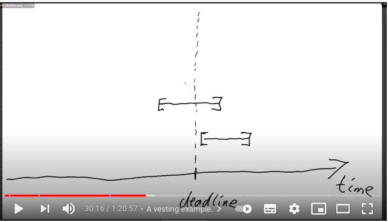
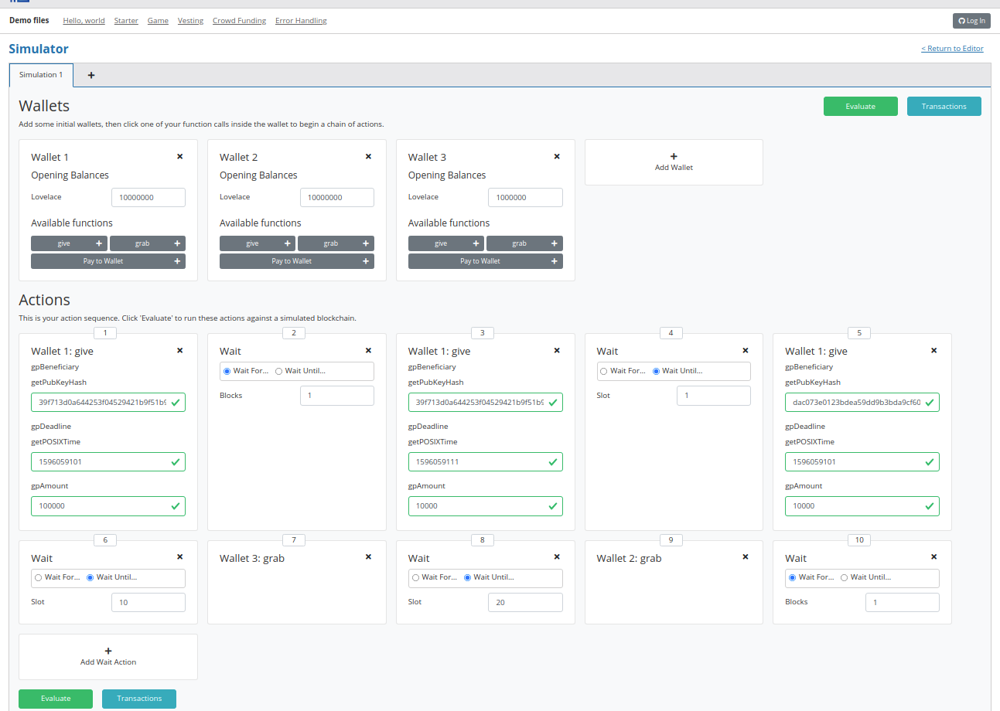

Clase 03 [Lecture03](https://www.youtube.com/watch?v=6_rfCCY9_gY)

# Sobre el error ResponseTimeout

- Como ya apunté en la primera clase, un problema frecuente es que el servicio de compilación y simulación, _plutus-playground-server_, debido una temporización de respuesta de 30s, termina con error al agotar este plazo.

- Para evitar este problema han actualizado el servidor y añadido un parámetro, _-i_, que permite aumentar el valor de esta temporización a gusto del consumidor.

```bash
[nix-shell]$ plutus-playground-server -i 120s

```

# El tipo de dato ScripContext 

- En las clases anteriores se presentaron los modelos de contabilidad _UTXO_ (Unspent Transaction Output), que utiliza Bitcoin, y _EUTXO_ (Extended Unspent Transaction Output) que utiliza Cardano.
- El EUTXO utiliza tres estructuras de información: _Datum_, _Redeemer_ y _Context_. En las lecciones anteriores se trabajó sobre las dos primeras. Esta lección se centrará en el Context y el tipo de dato que se utiliza en Plutus para su manejo, _ScriptContext_.


## Definición

- [Paquete : plutus-ledger-api | Módulo: plutus.v1.legder.context](https://alpha.marlowe.iohkdev.io/doc/haddock/plutus-ledger-api/html/Plutus-V1-Ledger-Contexts.html#t:ScriptContext)

- Es un dato de tipo registro, _record_, con dos campos:
  - scriptContextTxInfo: El más interesante, veremos porqué.
  - scriptContexPurpose: Describe el próposito del script. Por el momento hay cuatro:
    - Minting: Acuñar (mint) o destruir (burn) moneda. Se utiliza para crear _tokens_ nativos y definir las circunstancias en las que se pueden crear y destruir.
    - Spending: Validar una trasacción. Es el tipo de contexto que hemos visto hasta ahora y del que vamos a tratar en esta clase.
    - Rewarding: Relacionado con el _staking_ (_stake pools_ supongo) y las recompensas
    - Certifying: Relacionado con certificados y la delegación de certificados (¿?)

- Vamos a centrarnos en el scriptContextTxInfo que es del tipo _TxInfo_ (trasaction info), también definido en este paquete.

# ScriptContextTxInfo

- Este campo describe la transacción que se va a gastar. En el modelo _ETXO_ que Cardano utiliza, el _contexto de la validación_ es la transacción a gastar, con sus entradas y salidas. Esta información se almacena en una estructura de tipo _TxInfo_.
- Vamos a analizar su contenido:
```
data TxInfo

Trasacción pendiente, tal como la ven los scripts de validación.

Constructors

TxInfo	 
txInfoInputs :: [TxInInfo]	
Entradas de la transacción

txInfoOutputs :: [TxOut]	
Salidas de la transacción.

txInfoFee :: Value	
La comisión pagada por la transacción

txInfoForge :: Value	
Cantidad de moneda o _tokens_, forjados en esta transacción, Puede ser positivo, si se acuña moneda, o negativo, si se destruye. He utilizado el termino forjar porque está alineado con el término acuñar, pero fabricar también sería válido.

txInfoDCert :: [DCert]	
Certificados incluidos en la transacción.

txInfoWdrl :: [(StakingCredential, Integer)]	
Retiradas asociadas, entiendo, al _stake pool_ que ejecuta la transacción.

txInfoValidRange :: POSIXTimeRange	
Rango de tiempo en el que la transacción es válida.

txInfoSignatories :: [PubKeyHash]	
Lista de claves públicas que han firmado la transacción.

txInfoData :: [(DatumHash, Datum)]	 
Las transacciones que consumen la salida de un script tienen que contener el _Datum_ de la salida del script. Si la transacción envía dinero a un script, solo es necesario incluir el hash. En resumen, esta estructura es un diccionario (clave, valor: _DatumHash_, _Datum_)

txInfoId :: TxId	
Identificador de la transacción.
```

- Una de las ventajas del modelo _UTXO_ de Cardano respecto, por ejemplo, al de Ethereum, es que las validaciones puede realizarse en el _wallet_ (monedero, billetera: mejor monedero). Una transacción puede fallar si la transacción consume (los términos consumir y gastar son sinónimos) una entrada tal que, cuando la transacción llega a un nodo para ser validada, ya ha sido consumida por otra transacción. En este caso la transacción falla sin tener que pagar ninguna conmisión.
- Lo que no debería ocurrir nunca, o no debería ocurrir en circunstancias normales, es que un script de validación se ejecute y falle. Siempre se puede ejecutar un script, en un nodo, exactamente en las mismas condiciones que en un monedero, por tanto, se debería poder comprobar si falla antes de entregarlo (entiendo que se refiere a entregarlo y desplegarlo)
- Lo que _no_ está claro es como gestionar el tiempo en este contexto. Es probable que la lógica de validación defina que una transacción es válida antes o después de cierto punto en el tiempo ( ejemplo de la subasta de la primera clase). ¿Cómo asegurar que una validación, en cuya lógica interviene el tiempo, en un monedero y en un nodo se van a cumplir en ambos cuando, obviamente, una va a suceder después de la otra?. Para alcanzar este objetivo Cardano ha introducido el campo _txInfoValidRange_ , que especifica un rango de tiempo en el cual la transacción es válida ( supongo que ser refiere a que la transacción se puede ejecutar). Una de las primeras acciones en un nodo es verificar que el momento en el que se está procesando la transacción está dentro del rango definido en este campo. Esta comprobación se realiza _antes_ de ejecutar los scripts de validación.
- Este mecanismo permite que las validaciones sean independientes de dónde (monedero o nodo) y cuando se ejecuten. 
  - Si la validación del intervalo no es correcta, el script de validación no se ejecuta. 
  - Si es correcta, no hay que preocuparse del momento en el que se ejecuta (esto habrá que verlo)

# txInfoValidRange

- Este intervalo de tiempo es, por defecto, infinito cuando se crea una transacción:
  - Comienza en el momento en el que se creo la primera transacción (_genesis record_) y no termina nunca. Esto significa que una transacción con este intervalo será válida siempre, sin importar en qué momento llega a un nodo para ser validada.
  - El caso de la subasta sería una excepción puesto que las transacciones _bid_ y _close_ solo son válidas en un momento dado, antes de que termine la subasta y después de que termine la subasta.
  - En general, todas las transacciones, incluidas las que se generan a través del monedero (_Daedalus_) utilizan este intervalo infinito.

- Un pequeña complicación surge respecto al protocolo de consenso de Cardano. Este protocolo no mide el tiempo de la misma forma. Utiliza el concepto de _slot_, es decir, la unidad de medida del tiempo en Cardano es el _slot_, pero Plutus utiliza segundos (_POSIX time_). Por tanto, es necesario un sistema de conversión. Ahora no es un problema mientras la duración del _slot_ sea fija. Ahora la relación es 1 _slot_ = 1 segundo. Pero esto puede cambiar en el futuro.
  - Para evitar futuras complicaciones si este valor cambia, se ha fijado un valor máximo para el cual esta relación de unidades de medida es conocida: 36 horas. Es decir, sabemos que desde este momento hasta 36 horas en el futuro la relación es de 1 _slot_ = 1 segundo. Esto implica que la duración de un intervalo no puede ser mayor de 36 horas. Por tanto un intervalo de validez de una transacción:
    - O es infinito.
    - O es menor de 36 horas.
  - En el caso de la subasta su duración no deber ser superior a 36 horas.
  
# Plutus.V1.Legder.interval
- La clase continua con un análisis del tipo de datos _interval_ y las funciones relacionadas para operar con él.

```
Prelude Week03.Homework1> import Plutus.V1.Ledger.Interval 
Prelude Plutus.V1.Ledger.Interval Week03.Homework1> interval (10 :: Integer) 20
Interval {ivFrom = LowerBound (Finite 10) True, ivTo = UpperBound (Finite 20) True}
Prelude Plutus.V1.Ledger.Interval Week03.Homework1> member 9 in
init          interact      intersection  interval
Prelude Plutus.V1.Ledger.Interval Week03.Homework1> member 9 $ interval (10 :: Integer) 20
False
Prelude Plutus.V1.Ledger.Interval Week03.Homework1> member 10 $ interval (10 :: Integer) 20
True
Prelude Plutus.V1.Ledger.Interval Week03.Homework1> member 20 $ interval (10 :: Integer) 20
True
Prelude Plutus.V1.Ledger.Interval Week03.Homework1> member 21 $ interval (10 :: Integer) 20
False
Prelude Plutus.V1.Ledger.Interval Week03.Homework1> member 20 $ from (30 :: Integer)
False
Prelude Plutus.V1.Ledger.Interval Week03.Homework1> member 32 $ from (30 :: Integer)
True
Prelude Plutus.V1.Ledger.Interval Week03.Homework1> intersection ( interval (10 :: Integer) 20) $ interval 18 30
Interval {ivFrom = LowerBound (Finite 18) True, ivTo = UpperBound (Finite 20) True}
Prelude Plutus.V1.Ledger.Interval Week03.Homework1> contains (to (100 :: Integer)) $ interval 20 100
True
Prelude Plutus.V1.Ledger.Interval Week03.Homework1> overlaps (to (100 :: Integer)) $ interval 30 101
True
Prelude Plutus.V1.Ledger.Interval Week03.Homework1> contains (to (100 :: Integer)) $ interval 30 101
False
```

# Vesting: como usar el rango de tiempo, _txInfoValidRange_, en una trasacción
- Lars, el _master_, en esta clase propone un ejemplo de como usar este campo en una transacción.

> Se desea realizar un regalo a un familiar, por ejemplo un sobrin@, de una cantidad de ADA, pero el sobrin@ solo tendrá acceso a dichos fondos cuando cumpla cierta edad, por ejemplo, 18 años.

- El código del fichero [Vesting.hs](../code/Vesting.hs) es una implementación de este caso (la traducción de vesting adjudicar pero creo aquí, en España, sería más parecido a donar)

> El caso general se puede describir así: poner dinero en un script pero solo una persona específica puede retirarlo a partir de un momento dado.

- Este el primer caso en el vamos a utilizar un contexto en el script de validación. Lo primero es definir los parámetros y tipos de datos de esos parámetros en nuestro script:
  - El _Datum_ contedrá los datos del beneficiario, una clave pública, y la fecha a partir de la que se pueden retirar los fondos, en segundos (POSIXTime).
    ```haskell
      data VestingDatum = VestingDatum
          { beneficiary :: PubKeyHash
          , deadline    :: POSIXTime
          } deriving Show

      PlutusTx.unstableMakeIsData ''VestingDatum
    ```
 - El script de validación:
 ```haskell
{-# INLINABLE mkValidator #-}
mkValidator :: VestingDatum -> () -> ScriptContext -> Bool
mkValidator dat () ctx = traceIfFalse "beneficiary's signature missing" signedByBeneficiary &&
                         traceIfFalse "deadline not reached" deadlineReached
  where
    info :: TxInfo
    info = scriptContextTxInfo ctx

    signedByBeneficiary :: Bool
    signedByBeneficiary = txSignedBy info $ beneficiary dat

    deadlineReached :: Bool
    deadlineReached = contains (from $ deadline dat) $ txInfoValidRange info
  
```
  - Como siempre, tres parámetros: _Datum_, _Redeemer_ y _ScripContext_.
    - _Datum_ : Serían los datos del beneficiario, _dat_ de tipo _VestingDatum_
    - _Redeemer_: No es necesario en este caso, luego () (_unity_)
    - _ScriptContext_: El contexto, _ctx_ de tipo _ScriptContext_.

  - El script de validación solo tendrá que comprobar dos condiciones:
    - Que la firma del beneficiario es correcta:
      ```haskell
      traceIfFalse "beneficiary's signature missing" signedByBeneficiary
      ```
    - Que la fecha límite, _deadline_, se ha alcanzado:
      ```haskell
      traceIfFalse "deadline not reached" deadlineReached
      ```
  - Las condiciones se comprueban así:
    - Extraemos la información de contexto del script:
      ``` haskell
      info :: TxInfo
      info = scriptContextTxInfo ctx
      ```
    - Extraemos la firma del beneficiario del contexto del script, que se proporciona cuando se envía el script a la red y la comparamos con la que incluye la transacción de retirada que se recibirá en alǵun momento.
    - Extraemos el rango de validación de la transacción y lo comparamos con el del script.
      - ¿Cómo controlar el tiempo en esta transacción? 
      - El rango de validación del script debe comenzar en la fecha límite y durar hasta el infinito. 
      - El rango de validación de la transacción debe comenzar después de la fecha límite y durar 
      hasta el infito (límite superior del intervalo= infinito)
        > ¿Se supone que no puedes generar/adjudicar rangos en una transacción que comienzen en el futuro? Si fuera así, podría generar una transacción ahora mismo que cumpliese la condición. Habría que comprobar que la transacción se ha _generado_ después de la fecha límite.
        A no ser que el script y la transacción de retirada se hayan generado a la vez y por la misma persona interesada que esto ocurra de la manera establecida. 
        ¡¡ESTO NO ESTÁ CLARO!!

      ```haskell
      deadlineReached :: Bool
      deadlineReached = contains (from $ deadline dat) $ txInfoValidRange info
      ```
## Schema
```haskell
data GiveParams = GiveParams
    { gpBeneficiary :: !PubKeyHash
    , gpDeadline    :: !POSIXTime
    , gpAmount      :: !Integer
    } deriving (Generic, ToJSON, FromJSON, ToSchema)

type VestingSchema =
            Endpoint "give" GiveParams
        .\/ Endpoint "grab" ()
```
- Un esquemas con dos _endpoints_:
  - _give_ para crear el contrato de donación. Parámetros:
    - _gpBeneficiary_ : La clave pública del beneficiario
    - _gpDeadline_: La fecha límite.
    - _gpAmount_: La cantidad a donar.
  - _grab_ para retirar la donación: sin parámetros, la transacción contendrá la información necesaria.

## Endpoints
### _give_
- Este _endpoint_ crea el contrato de donación 
```haskell
give :: AsContractError e => GiveParams -> Contract w s e ()
give gp = do
    let dat = VestingDatum
                { beneficiary = gpBeneficiary gp
                , deadline    = gpDeadline gp
                }
        tx  = mustPayToTheScript dat $ Ada.lovelaceValueOf $ gpAmount gp
    ledgerTx <- submitTxConstraints typedValidator tx
    void $ awaitTxConfirmed $ txId ledgerTx
    logInfo @String $ printf "made a gift of %d lovelace to %s with deadline %s"
        (gpAmount gp)
        (show $ gpBeneficiary gp)
        (show $ gpDeadline gp)
```
### _grab_
- Este _endpoint_ retira la donación si se cumplen las validaciones pertinentes.
  - Aquí si se tiene en cuenta el _momento_ en el que crea la transacción.
```haskell
grab :: forall w s e. AsContractError e => Contract w s e ()
grab = do
    now   <- currentTime
    pkh   <- pubKeyHash <$> ownPubKey
    utxos <- Map.filter (isSuitable pkh now) <$> utxoAt scrAddress
    if Map.null utxos
        then logInfo @String $ "no gifts available"
        else do
            let orefs   = fst <$> Map.toList utxos
                lookups = Constraints.unspentOutputs utxos  <>
                          Constraints.otherScript validator
                tx :: TxConstraints Void Void
                tx      = mconcat [mustSpendScriptOutput oref $ Redeemer $ PlutusTx.toData () | oref <- orefs] <>
                          mustValidateIn (from now)
            ledgerTx <- submitTxConstraintsWith @Void lookups tx
            void $ awaitTxConfirmed $ txId ledgerTx
            logInfo @String $ "collected gifts"
  where
    isSuitable :: PubKeyHash -> POSIXTime -> TxOutTx -> Bool
    isSuitable pkh now o = case txOutDatumHash $ txOutTxOut o of
        Nothing -> False
        Just h  -> case Map.lookup h $ txData $ txOutTxTx o of
            Nothing        -> False
            Just (Datum e) -> case PlutusTx.fromData e of
                Nothing -> False
                Just d  -> beneficiary d == pkh && deadline d <= now

```

- Este proceso es un poco más complicado de lo que hemos visto hasta ahora.
  - Hay que comprobar que el emisor de la transacción es el beneficiario de la donación y que el momento en el que se recibe la transacción es posterior a la fecha límite.
  - Para realizar esta comprobación hay que cotejar todas las transacciones asociadas al contrato con la recibida.
    - Anteriormente se indico que la información de las transacciones asociadas _txInfoData_, podían contener solo el hash de la transacción. En este caso es obligatorio que contenga los datos y así lo hace por construcción, es decir, que se ha codificado así en el _endpoint_ _give_.
  ```haskell
    now   <- currentTime -- Fecha actual (segundos)
    pkh   <- pubKeyHash <$> ownPubKey -- Clave pública de la transacción (hash)
    utxos <- Map.filter (isSuitable pkh now) <$> utxoAt scrAddress -- Comprobación de transacciones
    ...
    ...

    isSuitable :: PubKeyHash -> POSIXTime -> TxOutTx -> Bool
    isSuitable pkh now o = case txOutDatumHash $ txOutTxOut o of
        Nothing -> False
        Just h  -> case Map.lookup h $ txData $ txOutTxTx o of
            Nothing        -> False
            Just (Datum e) -> case PlutusTx.fromData e of
                Nothing -> False
                Just d  -> beneficiary d == pkh && deadline d <= now -- Comprobación del beneficiario y la fecha límite.

  ```
  - Si detectamos alguna coincidencia, entonces se ejecuta el contrato de donación (el _script_), siempre y cuando la validación sea correcta.

  ```haskell
  if Map.null utxos
        then logInfo @String $ "no gifts available"
        else do
            -- Se contruye una trasacción, la de donación.
            let orefs   = fst <$> Map.toList utxos
                lookups = Constraints.unspentOutputs utxos  <>
                          Constraints.otherScript validator
                tx :: TxConstraints Void Void
                tx      = mconcat [mustSpendScriptOutput oref $ Redeemer $ PlutusTx.toData () | oref <- orefs] <>
                          mustValidateIn (from now)
            ledgerTx <- submitTxConstraintsWith @Void lookups tx
            void $ awaitTxConfirmed $ txId ledgerTx
            logInfo @String $ "collected gifts"
  ```
  > Todavía no acabo de entender la sintaxis de Haskell y como se crea una transacción. Las explicaciones de Lars dan por supuesto unos cuantos conceptos que no entiendo con claridad.

# Simulación

## Obtener la clave de un monedero
```
Prelude Week03.Homework1> :l src/Week03/Vesting.hs 
Ok, one module loaded.
Prelude Week03.Vesting> import Ledger
Prelude Ledger Week03.Vesting> import Wallet.Emulator
Prelude Ledger Wallet.Emulator Week03.Vesting> :i Wallet
type Wallet :: *
newtype Wallet = Wallet {getWallet :: Integer}
  	-- Defined in ‘Wallet.Emulator.Wallet’
instance Eq Wallet -- Defined in ‘Wallet.Emulator.Wallet’
instance Ord Wallet -- Defined in ‘Wallet.Emulator.Wallet’
instance Show Wallet -- Defined in ‘Wallet.Emulator.Wallet’
Prelude Ledger Wallet.Emulator Week03.Vesting> :t walletPubKey 
walletPubKey :: Wallet -> PubKey
Prelude Ledger Wallet.Emulator Week03.Vesting> :t PubKey
PubKey :: Plutus.V1.Ledger.Bytes.LedgerBytes -> PubKey
Prelude Ledger Wallet.Emulator Week03.Vesting> pubKeyHash $ walletPubKey $ Wallet 2
39f713d0a644253f04529421b9f51b9b08979d08295959c4f3990ee617f5139f
Prelude Ledger Wallet.Emulator Week03.Vesting> pubKeyHash $ walletPubKey $ Wallet 3
dac073e0123bdea59dd9b3bda9cf6037f63aca82627d7abcd5c4ac29dd74003e
```
## Obtener la fecha ĺimite
```
Prelude Ledger Wallet.Emulator Ledger.TimeSlot Week03.Vesting> import Ledger.TimeSlot 
Prelude Ledger Wallet.Emulator Ledger.TimeSlot Week03.Vesting> :t slotToBeginPOSIXTime 
slotToBeginPOSIXTime :: SlotConfig -> Slot -> POSIXTime
Prelude Ledger Wallet.Emulator Ledger.TimeSlot Week03.Vesting> :i SlotConfig 
type SlotConfig :: *
data SlotConfig
  = SlotConfig {scSlotLength :: Integer, scZeroSlotTime :: POSIXTime}
  	-- Defined in ‘Ledger.TimeSlot’
instance Eq SlotConfig -- Defined in ‘Ledger.TimeSlot’
instance Show SlotConfig -- Defined in ‘Ledger.TimeSlot’
Prelude Ledger Wallet.Emulator Ledger.TimeSlot Week03.Vesting> import Data.Default 
Prelude Ledger Wallet.Emulator Ledger.TimeSlot Data.Default Week03.Vesting> :i Default 
type Default :: * -> Constraint
class Default a where
  def :: a
  default def :: (GHC.Generics.Generic a,
                  data-default-class-0.1.2.0:Data.Default.Class.GDefault
                    (GHC.Generics.Rep a)) =>
                 a
  	-- Defined in ‘data-default-class-0.1.2.0:Data.Default.Class’
instance Default SlotConfig -- Defined in ‘Ledger.TimeSlot’
instance [safe] Default [a]
  -- Defined in ‘data-default-class-0.1.2.0:Data.Default.Class’
instance [safe] Default Word
  -- Defined in ‘data-default-class-0.1.2.0:Data.Default.Class’
instance [safe] Default Ordering
  -- Defined in ‘data-default-class-0.1.2.0:Data.Default.Class’
instance [safe] Default (Maybe a)
  -- Defined in ‘data-default-class-0.1.2.0:Data.Default.Class’
instance [safe] Default Integer
  -- Defined in ‘data-default-class-0.1.2.0:Data.Default.Class’
instance [safe] Default Int
  -- Defined in ‘data-default-class-0.1.2.0:Data.Default.Class’
instance [safe] Default a => Default (IO a)
  -- Defined in ‘data-default-class-0.1.2.0:Data.Default.Class’
instance [safe] Default Float
  -- Defined in ‘data-default-class-0.1.2.0:Data.Default.Class’
instance [safe] Default Double
  -- Defined in ‘data-default-class-0.1.2.0:Data.Default.Class’
instance [safe] Default r => Default (e -> r)
  -- Defined in ‘data-default-class-0.1.2.0:Data.Default.Class’
instance [safe] (Default a, Default b, Default c, Default d,
                 Default e, Default f, Default g) =>
                Default (a, b, c, d, e, f, g)
  -- Defined in ‘data-default-class-0.1.2.0:Data.Default.Class’
instance [safe] (Default a, Default b, Default c, Default d,
                 Default e, Default f) =>
                Default (a, b, c, d, e, f)
  -- Defined in ‘data-default-class-0.1.2.0:Data.Default.Class’
instance [safe] (Default a, Default b, Default c, Default d,
                 Default e) =>
                Default (a, b, c, d, e)
  -- Defined in ‘data-default-class-0.1.2.0:Data.Default.Class’
instance [safe] (Default a, Default b, Default c, Default d) =>
                Default (a, b, c, d)
  -- Defined in ‘data-default-class-0.1.2.0:Data.Default.Class’
instance [safe] (Default a, Default b, Default c) =>
                Default (a, b, c)
  -- Defined in ‘data-default-class-0.1.2.0:Data.Default.Class’
instance [safe] (Default a, Default b) => Default (a, b)
  -- Defined in ‘data-default-class-0.1.2.0:Data.Default.Class’
instance [safe] Default ()
  -- Defined in ‘data-default-class-0.1.2.0:Data.Default.Class’
instance Default Bool
  -- Defined in ‘shelley-spec-ledger-0.1.0.0:Shelley.Spec.Ledger.Orphans’
Prelude Ledger Wallet.Emulator Ledger.TimeSlot Data.Default Week03.Vesting> :i SlotConfig 
type SlotConfig :: *
data SlotConfig
  = SlotConfig {scSlotLength :: Integer, scZeroSlotTime :: POSIXTime}
  	-- Defined in ‘Ledger.TimeSlot’
instance Eq SlotConfig -- Defined in ‘Ledger.TimeSlot’
instance Show SlotConfig -- Defined in ‘Ledger.TimeSlot’
instance Default SlotConfig -- Defined in ‘Ledger.TimeSlot’
Prelude Ledger Wallet.Emulator Ledger.TimeSlot Data.Default Week03.Vesting> def :: SlotConfig
SlotConfig {scSlotLength = 1000, scZeroSlotTime = POSIXTime {getPOSIXTime = 1596059091000}}
Prelude Ledger Wallet.Emulator Ledger.TimeSlot Data.Default Week03.Vesting> slotToBeginPOSIXTime def 10
POSIXTime {getPOSIXTime = 1596059101000}
Prelude Ledger Wallet.Emulator Ledger.TimeSlot Data.Default Week03.Vesting> slotToBeginPOSIXTime def 20
POSIXTime {getPOSIXTime = 1596059111000}
```

## Datos de entrada de la simulación
- La simulación consiste en 3 donaciones:
  - De Wallet 1 a Wallet 2 (2): En los slots 10 y 20
  - De Wallet 1 a Wallet 3 (1): En el slot 20.


- La simulación no funciona: "no gifts available"
  - Datos
    Wallet 1: 21fe31dfa154a261626bf854046fd2271b7bed4b6abe45aa58877ef47f9721b9
    Wallet 2: 39f713d0a644253f04529421b9f51b9b08979d08295959c4f3990ee617f5139f
    Wallet 3: dac073e0123bdea59dd9b3bda9cf6037f63aca82627d7abcd5c4ac29dd74003e
    Slot 10: 1596059101000 -> 1596059101
    Slot 20: 1596059111000 -> 1596059111
  - El problema está en la definición de la fecha límite: slotToBeginPOSIXTime devuelve POSIXTime en MILISEGUNDOS y el resultado de la función currentTime, que es POSIXTime también pero en SEGUNDOS. Debido a esto la comprobación de la fecha límite nunca se cumple ya que siempre es mayor que la fecha actual. No entiendo esta diferencia, ¿un problema de mi SO?
  - Con este cambio, introducir el tiempo en segundos, la simulación funciona correctamente.


## Validaciones off-chain y on-chain
- En este ejemplo, la validación _off-chain_ (_grab_) que se ejecuta en el monedero, solo envía la transacción si esta es válida, es decir, si la fecha límite, _deadline_ se ha cumplido, y si es el beneficiario el que está generando la transacción, por tanto, con esta programación, el validador _on_chain_, siempre se cumple. Pero esto no tiene porqué ser así y alguien puede escribir otro código que no sea honesto.

    > Hay que tener esto en cuenta siempre: las validaciones siempre _on_chain_.

    > Es el mismo escenario de una arquitectura cliente-servidor: el servidor siempre debe comprobar que los datos son correctos y no esperar que el cliente sea honesto.


# Parameterized: Contratos parametrizados

- Partiendo del ejemplo anterior, _vesting.hs_, vamos a realizar algunas modificaciones para que la información del beneficiario y la fecha límite se incluya en el contrato mediante un parámetro. Es una generalización.

```haskell
data VestingParam = VestingParam
{ beneficiary :: PubKeyHash
, deadline    :: POSIXTime
} deriving Show

PlutusTx.makeLift ''VestingParam

{-# INLINABLE mkValidator #-}
mkValidator :: VestingParam -> () -> () -> ScriptContext -> Bool
mkValidator p () () ctx = traceIfFalse "beneficiary's signature missing" signedByBeneficiary &&
                          traceIfFalse "deadline not reached" deadlineReached
  where
    info :: TxInfo
    info = scriptContextTxInfo ctx

    signedByBeneficiary :: Bool
    signedByBeneficiary = txSignedBy info $ beneficiary p

    deadlineReached :: Bool
    deadlineReached = contains (from $ deadline p) $ txInfoValidRange info

data Vesting
instance Scripts.ValidatorTypes Vesting where
    type instance DatumType Vesting = ()
    type instance RedeemerType Vesting = ()

typedValidator :: VestingParam -> Scripts.TypedValidator Vesting
typedValidator p = Scripts.mkTypedValidator @Vesting
    ($$(PlutusTx.compile [|| mkValidator ||]) `PlutusTx.applyCode` PlutusTx.liftCode p)
    $$(PlutusTx.compile [|| wrap ||])
  where
    wrap = Scripts.wrapValidator @() @()

validator :: VestingParam -> Validator
validator = Scripts.validatorScript . typedValidator

valHash :: VestingParam -> Ledger.ValidatorHash
valHash = Scripts.validatorHash . typedValidator

scrAddress :: VestingParam -> Ledger.Address
scrAddress = scriptAddress . validator
```

- Primero definimos la estructura de información de los parámetros y modificamos la firma del validador.
  - _Datum_ ya no es necesario -> ()
  - _Redeemer_, igual que antes -> ()
  - _ScriptContex_, igual que antes.
  - Aparece un nuevo parámetro _VestingParam_, que sustituye al _Datum_ de la versión _vesting.hs_

- Explicación de como compilar el validador en Plutus: _lift code_: Permite compilar en Plutus instancias de datos. Es un tema complejo, mejor acudir al video: 1:03:00.


## Simulación
- Entrada
  - La cronología es la misma que en el caso anterior.
    [Entrada](./parameterized_simulation_input.png)
    - La operación _grab_ tiene un parámetro nuevo, _gpDeadline_.
- Salida
  - Cada operación _give_ genera un script diferente, tienen direcciones diferentes. Es el efecto de la parametrización.
    - [Slot 0](./parameterized_simulation_slot0.png)
    - [Slot 20](./parameterized_simulation_slot20.png)

# Ejercicio 1
- Donación
  - Dos beneficiarios, en vez de uno.
  - La fecha límite se interpreta así.: El primer benficiario puede reciber la donación _HASTA LA FECHA LÍMITE_. El segundo beneficiario puede recibir la donación _DESPUES DE LA FECHA LÍMITE_.
    - Si el primer beneficiario no recupera la donación en el tiempo establecido, es segundo puede reclamarla, es decir si el donado no recupera la donación se devuelve al donante.
  - El ejercicio consiste en codificar la validación.

- Entrada:
  - Wallet 1 dona 50000 a Wallet 2 hasta el slot 20 (10)
  - Wallet 2 dona 50000 a Wallet 1 hasta el slot 10 (5)
  - Wallet 2 recupera la donación en slot 11.
  - Wallet 1 no hace nada
  - [Entrada](./homework1_input.png)
- Salida:
  - [Slot 11 tx0](./homework1_simulation_slot11_tx0.png)
  - [Slot 11 tx1](./homework1_simulation_slot11_tx1.png)

  - El resultado final es que Wallet 2 recupera su donación a Wallet 1, ya que este no la ha recuperado, y recibe la donación de Wallet 1.

  
  - Mi solución es la siguiente:
  ```haskell
  mkValidator dat () ctx =
  traceIfFalse "beneficiary1's signature missing" signedByBeneficiary1
    && traceIfFalse "deadline1 not reached" deadline1Reached
    || traceIfFalse "beneficiary2's signature missing" signedByBeneficiary2
      && traceIfFalse "deadline2 not reached" deadline2Reached
  where
    info :: TxInfo
    info = scriptContextTxInfo ctx

    signedByBeneficiary1 :: Bool
    signedByBeneficiary1 = txSignedBy info $ beneficiary1 dat

    signedByBeneficiary2 :: Bool
    signedByBeneficiary2 = txSignedBy info $ beneficiary2 dat

    deadline1Reached :: Bool
    deadline1Reached = contains (to $ deadline dat) $ txInfoValidRange info

    deadline2Reached :: Bool
    deadline2Reached = contains (from $ deadline dat) $ txInfoValidRange info
  ```
  - La único reseñable es el uso de los intervalos para detectar si se ha alcanzado o no la fecha límite.
    - Esta solución tiene un problema: los dos intervalos son cerrados por lo que, es posible que se cumplan las dos condiciones a la vez. ¿Cómo se define un intervalo abierto ?

# Ejercicio 2
- Donación parametrizada.
  - Partimos de ejemplo parameterized.hs. En este ejercicio, la clave del beneficiario será un parámetro y el _Datum_ será la fecha límite.

  - Mi solución
  ```haskell
  {-# INLINEABLE mkValidator #-}
  mkValidator :: PubKeyHash -> POSIXTime -> () -> ScriptContext -> Bool
  mkValidator p deadline () ctx =
  traceIfFalse "beneficiary's signature missing" signedByBeneficiary
    && traceIfFalse "deadline not reached" deadlineReached
  where
    info :: TxInfo
    info = scriptContextTxInfo ctx

    signedByBeneficiary :: Bool
    signedByBeneficiary = txSignedBy info p

    deadlineReached :: Bool
    deadlineReached = contains (from deadline) $ txInfoValidRange info

  data Vesting

  instance Scripts.ValidatorTypes Vesting where
    type DatumType Vesting = POSIXTime
    type RedeemerType Vesting = ()

  typedValidator :: PubKeyHash -> Scripts.TypedValidator Vesting
  typedValidator p =
    Scripts.mkTypedValidator @Vesting
      ($$(PlutusTx.compile [||mkValidator||]) `PlutusTx.applyCode` PlutusTx.liftCode p)
      $$(PlutusTx.compile [||wrap||])
    where
      wrap = Scripts.wrapValidator @POSIXTime @()

  validator :: PubKeyHash -> Validator
  validator = Scripts.validatorScript . typedValidator

  scrAddress :: PubKeyHash -> Ledger.Address
  scrAddress = scriptAddress . validator
  ```

- A destacar:
  - _mkvalidator_: La clave pública del beneficiario es un parámetro (p)
  - _lift code: Sigue siendo necesario para incluir el parámetro en tiempo de compilación
  - _Datum_: ahora contiene la fecha límite
  - Lo cierto es que este cambio influyen más en los _endpoints_ (_give_ y _grab_) puesto que su lógica se simplifica un poco.

