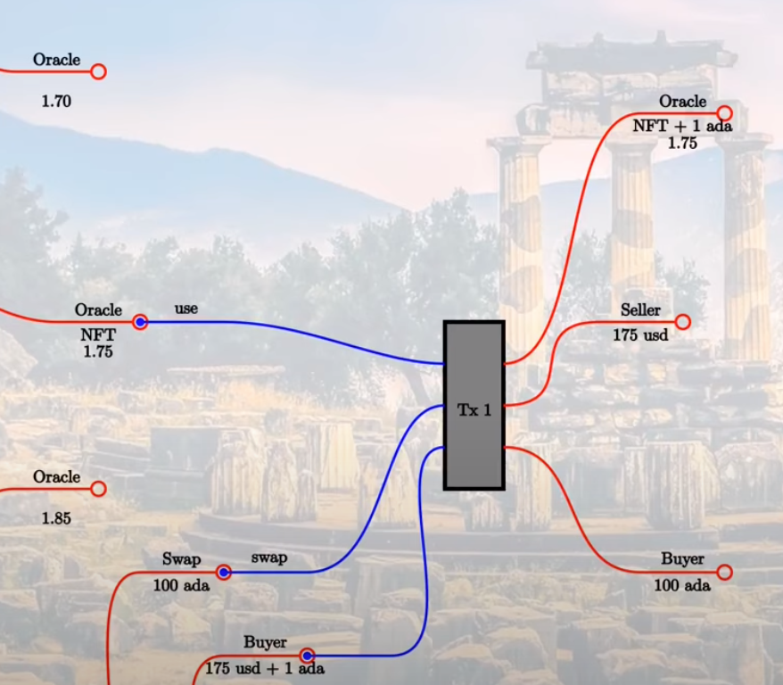
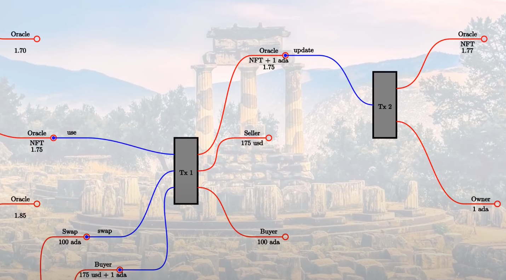

Clase 06
- [Video](https://www.youtube.com/watch?v=24SHPHEc3zo)
- [Notas](https://docs.plutus-community.com/docs/lectures/Lecture6.html)

# Introducción
- Vamos a analizar un caso de estudio que comprenda el uso de _oracles_ (_oráculos_). Un _oracle_ (_oráculo_) es una fuente de datos de confianza que puede utilizarse como entrada para realizar transacciones.

# Oracle 
- Para poder utilizar una fuente de información externa en una transacción en la _Blockchain_, la aproximación más sencilla es que esta información sea un UTXo. Hay otras formas más sofisticadas, pero para el propósito que nos ocupa, es suficiente.
- Por tanto, los datos que genera el _oracle_ se encapsulan en una UTXo que tienen como _dirección_ el _oracle_. El _Datum_ de la UTXo contrendrá la información.
    - En este caso, se trata de información en tiempo real de la cotización de ADA/USD.
- Primer problema: Un validación en un script _on chain_, solo se ejecuta cuando se _consume_ dicho UTXo. No se puede impedir la generación de UTXo arbitrarias desde el _oracle_.
- Para identificar de forma única esta UTXo, se utiliza un NFT, que se sabemos que es único. O sea, tenemos una UTXo tal que:
    - Proviene de un _oráculo_ determinado
    - Es única: Tiene un NFT asociada
    - Contiene un dato de confianza, el que sea (esto nos lo creeemos por el momento)

- En general, un _oráculo_ no sabe como van a utilizarse sus datos (entiendo que los ofrecerá en un formato dado, definido como  una API)

# Contrato
- Para nuestro caso, el contrato que es un servicio de _Swap_, donde de puede cambiar ADA por USD, a la cotización ofreciada por el _oráculo_.
- En la _blockchain_ no se puede realizar este cambio por lo que asumimos que utilizamo un NFT que representa a la moneda USD.

# Recompensa o incentivo
- Es necesario incentivar al _oráculo_ para que proporcione la información por lo que se fija un comisión por su uso en una trasacción, por ejemplo, 1 ADA.

# Transacción
- El proceso de la transacción se corresponde con el siguiente diagrama


- Entradas (UTXo):
    - **Oracle**: Cotización de ADA/USD (NFT 1.75)
        - **use**:
    - **Swap**: Nº de ADA que se desean intercambiar (100 ADA)
    - **Buyer**: Comprador de los ADA a la cotización proporcionada por el oráculo y comisión ( 175 USD + 1 ADA)
- Salidas (UTXo)
    - **Oracle**: El NFT, que no varía, y su la comisión a pagar (NTF 1.75 + 1 ADA
    - **Seller**: Recibe los USD (175 USD)
    - **Buyer**: Recibe los ADA.


# Actualización del valor de los datos de un Oráculo y recolección de comisiones.
- Esto es un tanto extraño. Esta claro que los datos que proporciona el oráculo pueden cambiar con el tiempo y que, además el dueño del oráculo debe ser capaz de cobrar las comisiones por su uso.
- En este caso de uso se ha añadido una operación que:
    - Permite cambiar el valor de la cotización
    - Permite recoger las comisiones asociadas al uso de este dato, si las tiene.



- La trasacción _update_ la realiza el _oráculo_
    - Para propocionar un valor nuevo
    - Para cobrar las comisiones.

# Implementación
- Vamos a analizar el código que implementa las operaciones que hemos descrito anteriormente.
## Oráculo

```haskell
data Oracle = Oracle
    { oSymbol   :: !CurrencySymbol
    , oOperator :: !PubKeyHash
    , oFee      :: !Integer
    , oAsset    :: !AssetClass
    } deriving (Show, Generic, FromJSON, ToJSON, Prelude.Eq, Prelude.Ord)

data OracleRedeemer = Update | Use
    deriving Show

{-# INLINABLE oracleTokenName #-}
oracleTokenName :: TokenName
oracleTokenName = TokenName emptyByteString

{-# INLINABLE oracleAsset #-}
oracleAsset :: Oracle -> AssetClass
oracleAsset oracle = AssetClass (oSymbol oracle, oracleTokenName)

{-# INLINABLE oracleValue #-}
oracleValue :: TxOut -> (DatumHash -> Maybe Datum) -> Maybe Integer
oracleValue o f = do
    dh      <- txOutDatum o
    Datum d <- f dh
    PlutusTx.fromBuiltinData d
```

- _oSymbol_: Símbolo del NFT que vamos a utilizar. _TokenName_ estará vacío.
- _oOperator_: _Hash_ de la clave pública del dueño del oráculo.
- _oFee_ : La comisión asociada al uso del dato.
- _oAsset_ : Activo por el que se va a intercambiar los ADA. En el ejemplo, USD, como este no existe
- _Redeemer_ : Dos operaciones sobre este UTXo: 
    - _update_: Para cambiar el valor del dato proporcionado y recolectar las comisiones
    - _use_ : Para usar el valor en una transacciónde _swap_.

- _oracleAsset_: Es el NFT que utilizamos en este oráculo. El nombre del token será la cadena vacía.
- _oracleValue_: Es el valor del dato que ofrece el oráculo, la cotización (será un entero para simplificar)
    - Esta función es una Mónada.

### Validación (_on chain_)
- Este código valida la UTXo del oráculo. Es el núcleo de nuestro proceso.
- Validación de la UTxo del oráculo según la operación a realizar (_update_, _use_).
```haskell
mkOracleValidator :: Oracle -> Integer -> OracleRedeemer -> ScriptContext -> Bool
mkOracleValidator oracle x r ctx =
    traceIfFalse "token missing from input"  inputHasToken  &&
    traceIfFalse "token missing from output" outputHasToken &&
    case r of
        Update -> traceIfFalse "operator signature missing" (txSignedBy info $ oOperator oracle) &&
                  traceIfFalse "invalid output datum"       validOutputDatum
        Use    -> traceIfFalse "oracle value changed"       (outputDatum == Just x)              &&
                  traceIfFalse "fees not paid"              feesPaid
```
- Hay que comprobar:
    - El NFT de la UTXo de entrada (la que se va a consumir)
    - El NFT de la UTXo de salida (la que se va a generar)
    - Si _update_:
        - Las firmas deben coincidir: UTXo y dueño del oráculo (solo el dueño puede cambiar un valor).
        - El valor de la cotización debe ser del tipo correcto.
    - Si _use_: 
        - La cotización utilizada (para realizar el _swap_) debe ser la del oráculo.
        - La comisión de uso debe haberse pagado.
        
### Oráculo (_off chain_)
- _startOracle_: Crea un oráculo: NFT, clave, comisiones, activo (USD)
    - Lo más interesante es la creación del NFT, que necesita un contrato con un script de minado:
    ```haskell
    osc <- mapError (pack . show) (mintContract pkh [(oracleTokenName, 1)] :: Contract w s CurrencyError OneShotCurrency)
    ```
- _updateOracle_: Cambia el valor de una cotización

