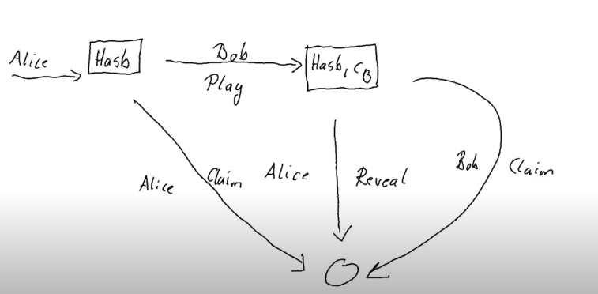
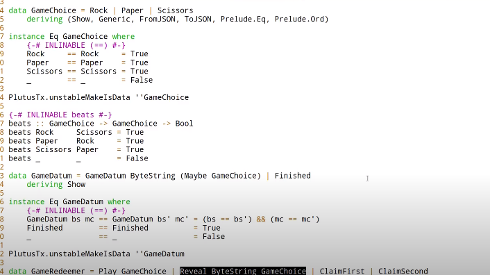

Clase 07
- [Video](https://www.youtube.com/watch?v=uwZ903Zd0DU)
- [Notas](https://docs.plutus-community.com/docs/lectures/Lecture7.html)

# Máquinas de estados (State Machines)
- También conocidos como máquinas de estado finitas o autómatas. Es un concepto matemático, algebraico, que permite código más compacto. Una máquina de estados se define mediante: 
> [Wikipedia](https://es.wikipedia.org/wiki/Aut%C3%B3mata_finito) Un autómata finito o máquina de estado finito es un modelo computacional que realiza cómputos en forma automática sobre una entrada para producir una salida. Este modelo está conformado por un alfabeto, un conjunto de estados finito, una función de transición, un estado inicial y un conjunto de estados finales.
# Ejemplo
- Juego con dos jugadores con una mecánica similar a _piedra, papel, tijera_ pero con 0 y 1 (solo dos opciones):
    - Los dos jugadores eligen una opción _al mismo tiempo_.
    - Si los dos eligen el mismo valor, gana Alice. Si eligen valores diferentes, gana Bob.

|       	|   	| Bob   	| Bob   	|   	|
|-------	|---	|-------	|-------	|---	|
|       	|   	| 0     	| 1     	|   	|
| Alice 	| 0 	| Alice 	| Bob   	|   	|
| Alice 	| 1 	| Bob   	| Alice 	|   	|

- La idea es que los jugadores puedan jugar a distancia de manera justa. Para ello vamos a utilizar _hash_:
    - Alica envía a Bob su elección: primero la _hash_ de su elección y luego la elección en claro. De esta forma Bob puede comprobar si su primera elección es la correcta.
    - El problema es que solo hay dos opciones, o sea, que a través de la hash se puede conocer la elección.
    - Para ello vamos introducir un valor aleatoria (_nonce_) que se concatena a la elección. Ahora lo que se envía es _hash(nonce || 0)_.
    - Esta opción es la vamos a codificar.

- La máquina de estados sería algo similar a esto: 
    1. Alice envía su jugada (_hash (nonce|| 0 o 1))
    2. Bob la recibe y hace su jugada (0 o 1). Esta jugada es pública.
    3. Como Alice sabe su jugada puede comprobar si ha ganado. Si ha ganado revela su jugada.
    4. Para que Bob comprueba si Alice dice la verdad debe generar la _hash_ de nuevo.
        - Para ello Alice, cuando revela su jugada, debe enviar el _nonce_, para que Bob pueda recrear la hash y cotejarla con la que envió Alice en primer lugar. La jugada es la misma que la de Bob. 
    5. Si las _hash_ coinciden, Alice gana.


# Implementación sin máquina de estados: EventOdd
- La implementación está en el fichero [EventOdd.hs](../code/EvenOdd.hs). Es un contrato que implementará el juego según la máquina de estados definida.

## Game

```haskell
data Game = Game
    { gFirst          :: !PubKeyHash
    , gSecond         :: !PubKeyHash
    , gStake          :: !Integer
    , gPlayDeadline   :: !POSIXTime
    , gRevealDeadline :: !POSIXTime
    , gToken          :: !AssetClass
    } deriving (Show, Generic, FromJSON, ToJSON, Prelude.Eq, Prelude.Ord)
```
- _Game_: es el tipo de dato con los parámetros del contrato.
- _gFirst_, _gSecond_: Claves de los jugadores.
- _gStake_: Apuesta.
- _gPlayDeadline_: Fecha tope para el que el segundo jugador haga su movimiento.
    - Si no lo hace, el primer jugador recibe su apuesta.
- _gRevealDeadline_: Fecha tope para el que primer jugador revele su juego. 
    - Si lo hace y gana, recibe la apuesta (la de ambos). 
    - Si lo hace y pierde, el segundo jugador recibe la apuesta (la de ambos)
    - Si no lo hace, cuando vence esta fecha, el segundo jugador recibe la apuesta (la de ambos)
- _gToken_: Es un NFT, con el mismo uso en un _óraculo_: permitirá identificar la UTXo adecuada, es decir, una partida.

## GameChoice
```haskell
data GameChoice = Zero | One
    deriving (Show, Generic, FromJSON, ToJSON, ToSchema, Prelude.Eq, Prelude.Ord)

instance Eq GameChoice where
    {-# INLINABLE (==) #-}
    Zero == Zero = True
    One  == One  = True
    _    == _    = False
```
- Dos opciones (0,1). Hay que definir el operador de comparación (_Eq_)

## Datum: GameDatum
```haskell
data GameDatum = GameDatum ByteString (Maybe GameChoice)
    deriving Show
instance Eq GameDatum where
    {-# INLINABLE (==) #-}
    GameDatum bs mc == GameDatum bs' mc' = (bs == bs') && (mc == mc')
```
- El dato de entrada, la jugada, es un _hash_ (_ByteString). 
- Hay dos, la primera es obligatoria, la segunda  es de tipo (_Maybe_), puesto que la primera vez no hay segunda jugada.
- También se define un operador de igualdad, para este tipo de dato.

## Redeemer: GameRedeemer
```haskell
data GameRedeemer = Play GameChoice | Reveal ByteString | ClaimFirst | ClaimSecond
    deriving Show
```
- Este tipo de dato se corresponde con las transiciones de la máquina de estados que define el juego.
    -  _Play_: el segundo jugador hace su jugada: argumento: (Zero|One)
    - _Reveal_: el primer jugador revela su jugada, si ha ganado: argumento: _nonce_. La jugada no tienen porqué enviarse ()
    - _ClaimFirst_: el primer jugador reclama su apuesta ya que el segundo no ha realizado su jugada.
    - _ClaimSecond_: el segundo jugador reclama su apuesta ya que el primero no ha revelado su jugada (ha perdido)

## Funciones auxiliares
```haskell
{-# INLINABLE lovelaces #-}
lovelaces :: Value -> Integer
lovelaces = Ada.getLovelace . Ada.fromValue

{-# INLINABLE gameDatum #-}
gameDatum :: TxOut -> (DatumHash -> Maybe Datum) -> Maybe GameDatum
gameDatum o f = do
    dh      <- txOutDatum o
    Datum d <- f dh
    PlutusTx.fromBuiltinData d
```
- _lovelaces_ : Para obtener un valor en _lovelaces_
- _gameDatum_ : Para extraer el _Datum_ de una UTXo.

## Validador
```haskell
mkGameValidator :: Game -> ByteString -> ByteString -> GameDatum -> GameRedeemer -> ScriptContext -> Bool
mkGameValidator game bsZero' bsOne' dat red ctx =
    traceIfFalse "token missing from input" (assetClassValueOf (txOutValue ownInput) (gToken game) == 1) &&
    case (dat, red) of
        (GameDatum bs Nothing, Play c) ->
            traceIfFalse "not signed by second player"   (txSignedBy info (gSecond game))                                   &&
            traceIfFalse "first player's stake missing"  (lovelaces (txOutValue ownInput) == gStake game)                   &&
            traceIfFalse "second player's stake missing" (lovelaces (txOutValue ownOutput) == (2 * gStake game))            &&
            traceIfFalse "wrong output datum"            (outputDatum == GameDatum bs (Just c))                             &&
            traceIfFalse "missed deadline"               (to (gPlayDeadline game) `contains` txInfoValidRange info)         &&
            traceIfFalse "token missing from output"     (assetClassValueOf (txOutValue ownOutput) (gToken game) == 1)

        (GameDatum bs (Just c), Reveal nonce) ->
            traceIfFalse "not signed by first player"    (txSignedBy info (gFirst game))                                    &&
            traceIfFalse "commit mismatch"               (checkNonce bs nonce c)                                            &&
            traceIfFalse "missed deadline"               (to (gRevealDeadline game) `contains` txInfoValidRange info)       &&
            traceIfFalse "wrong stake"                   (lovelaces (txOutValue ownInput) == (2 * gStake game))             &&
            traceIfFalse "NFT must go to first player"   nftToFirst

        (GameDatum _ Nothing, ClaimFirst) ->
            traceIfFalse "not signed by first player"    (txSignedBy info (gFirst game))                                    &&
            traceIfFalse "too early"                     (from (1 + gPlayDeadline game) `contains` txInfoValidRange info)   &&
            traceIfFalse "first player's stake missing"  (lovelaces (txOutValue ownInput) == gStake game)                   &&
            traceIfFalse "NFT must go to first player"   nftToFirst

        (GameDatum _ (Just _), ClaimSecond) ->
            traceIfFalse "not signed by second player"   (txSignedBy info (gSecond game))                                   &&
            traceIfFalse "too early"                     (from (1 + gRevealDeadline game) `contains` txInfoValidRange info) &&
            traceIfFalse "wrong stake"                   (lovelaces (txOutValue ownInput) == (2 * gStake game))             &&
            traceIfFalse "NFT must go to first player"   nftToFirst

        _                              -> False
  where
    info :: TxInfo
    info = scriptContextTxInfo ctx

    ownInput :: TxOut
    ownInput = case findOwnInput ctx of
        Nothing -> traceError "game input missing"
        Just i  -> txInInfoResolved i

    ownOutput :: TxOut
    ownOutput = case getContinuingOutputs ctx of
        [o] -> o
        _   -> traceError "expected exactly one game output"

    outputDatum :: GameDatum
    outputDatum = case gameDatum ownOutput (`findDatum` info) of
        Nothing -> traceError "game output datum not found"
        Just d  -> d

    checkNonce :: ByteString -> ByteString -> GameChoice -> Bool
    checkNonce bs nonce cSecond = sha2_256 (nonce `concatenate` cFirst) == bs
      where
        cFirst :: ByteString
        cFirst = case cSecond of
            Zero -> bsZero'
            One  -> bsOne'

    nftToFirst :: Bool
    nftToFirst = assetClassValueOf (valuePaidTo info $ gFirst game) (gToken game) == 1
```
- El validador se define como:
> mkGameValidator :: Game -> ByteString -> ByteString -> GameDatum -> GameRedeemer -> ScriptContext -> Bool
  Donde:
  - _Game_: Parámetros del contrato.
  - _ByteString_, _Bytestring_: Son los valores cero y uno pero como _bytestring_ . No se pueden pasar como literales por algún extraño y haskelliano motivo relacionado con el paso a Plutus (el código debe compilarse previamente como código Plutus)
  - _GameDatum_ , _GameRedeemer_,  _ScriptContext_: _as usual_

  - Vamos a analizar las funciones auxialiares
    - _info_: Info de _Scriptcontex_
    - _ownInput_: Solo puede haber una y debe haber una.
    - _ownOutput_: Idem, solo puede haber una. 
    - _outputDatum_: Son los datos de la jugada.
    - _checkNonce_: Para cotejar la jugada del primer jugador si este ha ganado (o dice que ha ganado: _Reveal_)
    - _nftToFirst_: Termine como termine el juego el NFT debe volver al primer jugador, no se gasta nunca pero sí se actualiza cada vez que se juega.
  - La lógica es la siguiente:
    1. La entrada que se valida debe estar identificada por el _token de estado_ (supongo que se refiere al NFT)
    2. Las posibles combinaciones de entradas se seleccionan en un una sentencia _case_:
        - El primer jugador ha movido y el segundo realiza su jugada (_Play c_)
        > (GameDatum bs Nothing, Play c) ->
        - Los dos jugadores ha realizado su jugada y el primer jugador revela su jugada, porque (_dice que_)ha ganado:
        > (GameDatum bs (Just c), Reveal nonce) ->
        - El primer jugador reclama el premio.
        >  (GameDatum _ Nothing, ClaimFirst) ->
        - El segundo jugador reclama el premio.
        > (GameDatum _ (Just _), ClaimSecond) ->
    3. No hay posibilidades. El resto de combinaciones fallará y no validará la transacción.


# A jugar
    - Dos funciones: _firstGame_ y _secondGame_

## firstGame
```haskell
firstGame :: forall w s. FirstParams -> Contract w s Text ()
firstGame fp = do
pkh <- pubKeyHash <$> Contract.ownPubKey
let game = Game
        { gFirst          = pkh
        , gSecond         = fpSecond fp
        , gStake          = fpStake fp
        , gPlayDeadline   = fpPlayDeadline fp
        , gRevealDeadline = fpRevealDeadline fp
        , gToken          = AssetClass (fpCurrency fp, fpTokenName fp)
        }
    v    = lovelaceValueOf (fpStake fp) <> assetClassValue (gToken game) 1
    c    = fpChoice fp
    bs   = sha2_256 $ fpNonce fp `concatenate` if c == Zero then bsZero else bsOne
    tx   = Constraints.mustPayToTheScript (GameDatum bs Nothing) v
ledgerTx <- submitTxConstraints (typedGameValidator game) tx
void $ awaitTxConfirmed $ txId ledgerTx
logInfo @String $ "made first move: " ++ show (fpChoice fp)

waitUntilTimeHasPassed $ fpPlayDeadline fp

m   <- findGameOutput game
now <- currentTime
case m of
    Nothing             -> throwError "game output not found"
    Just (oref, o, dat) -> case dat of
        GameDatum _ Nothing -> do
            logInfo @String "second player did not play"
            let lookups = Constraints.unspentOutputs (Map.singleton oref o) <>
                            Constraints.otherScript (gameValidator game)
                tx'     = Constraints.mustSpendScriptOutput oref (Redeemer $ PlutusTx.toBuiltinData ClaimFirst) <>
                            Constraints.mustValidateIn (from now)
            ledgerTx' <- submitTxConstraintsWith @Gaming lookups tx'
            void $ awaitTxConfirmed $ txId ledgerTx'
            logInfo @String "reclaimed stake"

        GameDatum _ (Just c') | c' == c -> do

            logInfo @String "second player played and lost"
            let lookups = Constraints.unspentOutputs (Map.singleton oref o) <>
                            Constraints.otherScript (gameValidator game)
                tx'     = Constraints.mustSpendScriptOutput oref (Redeemer $ PlutusTx.toBuiltinData $ Reveal $ fpNonce fp) <>
                            Constraints.mustValidateIn (to $ now + 1000)
            ledgerTx' <- submitTxConstraintsWith @Gaming lookups tx'
            void $ awaitTxConfirmed $ txId ledgerTx'
            logInfo @String "victory"

        _ -> logInfo @String "second player played and won"
```

## SecondGame
```haskell
data SecondParams = SecondParams
    { spFirst          :: !PubKeyHash
    , spStake          :: !Integer
    , spPlayDeadline   :: !POSIXTime
    , spRevealDeadline :: !POSIXTime
    , spCurrency       :: !CurrencySymbol
    , spTokenName      :: !TokenName
    , spChoice         :: !GameChoice
    } deriving (Show, Generic, FromJSON, ToJSON, ToSchema)

secondGame :: forall w s. SecondParams -> Contract w s Text ()
secondGame sp = do
    pkh <- pubKeyHash <$> Contract.ownPubKey
    let game = Game
            { gFirst          = spFirst sp
            , gSecond         = pkh
            , gStake          = spStake sp
            , gPlayDeadline   = spPlayDeadline sp
            , gRevealDeadline = spRevealDeadline sp
            , gToken          = AssetClass (spCurrency sp, spTokenName sp)
            }
    m <- findGameOutput game
    case m of
        Just (oref, o, GameDatum bs Nothing) -> do
            logInfo @String "running game found"
            now <- currentTime
            let token   = assetClassValue (gToken game) 1
            let v       = let x = lovelaceValueOf (spStake sp) in x <> x <> token
                c       = spChoice sp
                lookups = Constraints.unspentOutputs (Map.singleton oref o)                                   <>
                          Constraints.otherScript (gameValidator game)                                        <>
                          Constraints.typedValidatorLookups (typedGameValidator game)
                tx      = Constraints.mustSpendScriptOutput oref (Redeemer $ PlutusTx.toBuiltinData $ Play c) <>
                          Constraints.mustPayToTheScript (GameDatum bs $ Just c) v                            <>
                          Constraints.mustValidateIn (to now)
            ledgerTx <- submitTxConstraintsWith @Gaming lookups tx
            let tid = txId ledgerTx
            void $ awaitTxConfirmed tid
            logInfo @String $ "made second move: " ++ show (spChoice sp)

            waitUntilTimeHasPassed $ spRevealDeadline sp

            m'   <- findGameOutput game
            now' <- currentTime
            case m' of
                Nothing             -> logInfo @String "first player won"
                Just (oref', o', _) -> do
                    logInfo @String "first player didn't reveal"
                    let lookups' = Constraints.unspentOutputs (Map.singleton oref' o')                                     <>
                                   Constraints.otherScript (gameValidator game)
                        tx'      = Constraints.mustSpendScriptOutput oref' (Redeemer $ PlutusTx.toBuiltinData ClaimSecond) <>
                                   Constraints.mustValidateIn (from now')                                                  <>
                                   Constraints.mustPayToPubKey (spFirst sp) token
                    ledgerTx' <- submitTxConstraintsWith @Gaming lookups' tx'
                    void $ awaitTxConfirmed $ txId ledgerTx'
                    logInfo @String "second player won"

        _ -> logInfo @String "no running game found"
```

## Endpoints
- Para facilitar el uso de las funciones creamos unos _endpoints_ que se ejecutan uno detrás de otro (_first_, second_)
  
```haskell
type GameSchema = Endpoint "first" FirstParams .\/ Endpoint "second" SecondParams

endpoints :: Contract () GameSchema Text ()
endpoints = (first `select` second) >> endpoints
  where
    first  = endpoint @"first"  >>= firstGame
    second = endpoint @"second" >>= secondGame
```

# Probando: Test.hs

- Los resultados de la ejecución serían

```
Slot 00000: TxnValidate 9ed034bd9c98d2b1ff0b8b4c9a692868c10f38985391667ab34e1cd17056e1fc
Slot 00000: SlotAdd Slot 1
Slot 00001: *** USER LOG: first move: Zero, second move: Zero
Slot 00001: 00000000-0000-4000-8000-000000000000 {Contract instance for wallet 1}:
  Contract instance started
Slot 00001: 00000000-0000-4000-8000-000000000001 {Contract instance for wallet 2}:
  Contract instance started
Slot 00001: 00000000-0000-4000-8000-000000000000 {Contract instance for wallet 1}:
  Receive endpoint call on 'first' for Object (fromList [("contents",Array [Object (fromList [("getEndpointDescription",String "first")]),Object (fromList [("unEndpointValue",Object (fromList [("fpChoice",String "Zero"),("fpCurrency",Object (fromList [("unCurrencySymbol",String "ff")])),("fpNonce",String "5345435245544e4f4e4345"),("fpPlayDeadline",Number 1.596059096e12),("fpRevealDeadline",Number 1.596059101e12),("fpSecond",Object (fromList [("getPubKeyHash",String "977efb35ab621d39dbeb7274ec7795a34708ff4d25a01a1df04c1f27")])),("fpStake",Number 5000000.0),("fpTokenName",Object (fromList [("unTokenName",String "STATE TOKEN")]))]))])]),("tag",String "ExposeEndpointResp")])
Slot 00001: W1: TxSubmit: 6bab990b4317fe6d2d8417d04395b7967d8d2b094a36f4a9cdbe46321bd615cc
Slot 00001: TxnValidate 6bab990b4317fe6d2d8417d04395b7967d8d2b094a36f4a9cdbe46321bd615cc
Slot 00001: SlotAdd Slot 2
Slot 00002: *** CONTRACT LOG: "made first move: Zero"
Slot 00002: *** CONTRACT LOG: "current slot: Slot {getSlot = 2}, waiting until POSIXTime {getPOSIXTime = 1596059096000}"
Slot 00002: SlotAdd Slot 3
Slot 00003: SlotAdd Slot 4
Slot 00004: 00000000-0000-4000-8000-000000000001 {Contract instance for wallet 2}:
  Receive endpoint call on 'second' for Object (fromList [("contents",Array [Object (fromList [("getEndpointDescription",String "second")]),Object (fromList [("unEndpointValue",Object (fromList [("spChoice",String "Zero"),("spCurrency",Object (fromList [("unCurrencySymbol",String "ff")])),("spFirst",Object (fromList [("getPubKeyHash",String "35dedd2982a03cf39e7dce03c839994ffdec2ec6b04f1cf2d40e61a3")])),("spPlayDeadline",Number 1.596059096e12),("spRevealDeadline",Number 1.596059101e12),("spStake",Number 5000000.0),("spTokenName",Object (fromList [("unTokenName",String "STATE TOKEN")]))]))])]),("tag",String "ExposeEndpointResp")])
Slot 00004: *** CONTRACT LOG: "running game found"
Slot 00004: W2: TxSubmit: f2cfec9a8e717116682c3453d55b86d41bd4ae3b220d31586eb66ecdc8aa7472
Slot 00004: TxnValidate f2cfec9a8e717116682c3453d55b86d41bd4ae3b220d31586eb66ecdc8aa7472
Slot 00004: SlotAdd Slot 5
Slot 00005: *** CONTRACT LOG: "made second move: Zero"
Slot 00005: *** CONTRACT LOG: "current slot: Slot {getSlot = 5}, waiting until POSIXTime {getPOSIXTime = 1596059101000}"
Slot 00005: SlotAdd Slot 6
Slot 00006: *** CONTRACT LOG: "waited until: Slot {getSlot = 6}"
Slot 00006: *** CONTRACT LOG: "second player played and lost"
Slot 00006: W1: TxSubmit: 22a66195fbe46f2a48f6d83998a34f0de3e824a006e20cc77bcc871f94334446
Slot 00006: TxnValidate 22a66195fbe46f2a48f6d83998a34f0de3e824a006e20cc77bcc871f94334446
Slot 00006: SlotAdd Slot 7
Slot 00007: *** CONTRACT LOG: "victory"
Slot 00007: SlotAdd Slot 8
Slot 00008: SlotAdd Slot 9
Slot 00009: SlotAdd Slot 10
Slot 00010: SlotAdd Slot 11
Slot 00011: *** CONTRACT LOG: "waited until: Slot {getSlot = 11}"
Slot 00011: *** CONTRACT LOG: "first player won"
Slot 00011: SlotAdd Slot 12
Slot 00012: SlotAdd Slot 13
Slot 00013: SlotAdd Slot 14
Slot 00014: SlotAdd Slot 15
Final balances
Wallet 1: 
    {, ""}: 1004984215
    {ff, "STATE TOKEN"}: 1
Wallet 2: 
    {, ""}: 994984225
Slot 00000: TxnValidate 9ed034bd9c98d2b1ff0b8b4c9a692868c10f38985391667ab34e1cd17056e1fc
Slot 00000: SlotAdd Slot 1
Slot 00001: *** USER LOG: first move: Zero, second move: One
Slot 00001: 00000000-0000-4000-8000-000000000000 {Contract instance for wallet 1}:
  Contract instance started
Slot 00001: 00000000-0000-4000-8000-000000000001 {Contract instance for wallet 2}:
  Contract instance started
Slot 00001: 00000000-0000-4000-8000-000000000000 {Contract instance for wallet 1}:
  Receive endpoint call on 'first' for Object (fromList [("contents",Array [Object (fromList [("getEndpointDescription",String "first")]),Object (fromList [("unEndpointValue",Object (fromList [("fpChoice",String "Zero"),("fpCurrency",Object (fromList [("unCurrencySymbol",String "ff")])),("fpNonce",String "5345435245544e4f4e4345"),("fpPlayDeadline",Number 1.596059096e12),("fpRevealDeadline",Number 1.596059101e12),("fpSecond",Object (fromList [("getPubKeyHash",String "977efb35ab621d39dbeb7274ec7795a34708ff4d25a01a1df04c1f27")])),("fpStake",Number 5000000.0),("fpTokenName",Object (fromList [("unTokenName",String "STATE TOKEN")]))]))])]),("tag",String "ExposeEndpointResp")])
Slot 00001: W1: TxSubmit: 6bab990b4317fe6d2d8417d04395b7967d8d2b094a36f4a9cdbe46321bd615cc
Slot 00001: TxnValidate 6bab990b4317fe6d2d8417d04395b7967d8d2b094a36f4a9cdbe46321bd615cc
Slot 00001: SlotAdd Slot 2
Slot 00002: *** CONTRACT LOG: "made first move: Zero"
Slot 00002: *** CONTRACT LOG: "current slot: Slot {getSlot = 2}, waiting until POSIXTime {getPOSIXTime = 1596059096000}"
Slot 00002: SlotAdd Slot 3
Slot 00003: SlotAdd Slot 4
Slot 00004: 00000000-0000-4000-8000-000000000001 {Contract instance for wallet 2}:
  Receive endpoint call on 'second' for Object (fromList [("contents",Array [Object (fromList [("getEndpointDescription",String "second")]),Object (fromList [("unEndpointValue",Object (fromList [("spChoice",String "One"),("spCurrency",Object (fromList [("unCurrencySymbol",String "ff")])),("spFirst",Object (fromList [("getPubKeyHash",String "35dedd2982a03cf39e7dce03c839994ffdec2ec6b04f1cf2d40e61a3")])),("spPlayDeadline",Number 1.596059096e12),("spRevealDeadline",Number 1.596059101e12),("spStake",Number 5000000.0),("spTokenName",Object (fromList [("unTokenName",String "STATE TOKEN")]))]))])]),("tag",String "ExposeEndpointResp")])
Slot 00004: *** CONTRACT LOG: "running game found"
Slot 00004: W2: TxSubmit: 23ac5f235ec564975de4bb66790179429e19eb5666caaa792fb296e1c289943f
Slot 00004: TxnValidate 23ac5f235ec564975de4bb66790179429e19eb5666caaa792fb296e1c289943f
Slot 00004: SlotAdd Slot 5
Slot 00005: *** CONTRACT LOG: "made second move: One"
Slot 00005: *** CONTRACT LOG: "current slot: Slot {getSlot = 5}, waiting until POSIXTime {getPOSIXTime = 1596059101000}"
Slot 00005: SlotAdd Slot 6
Slot 00006: *** CONTRACT LOG: "waited until: Slot {getSlot = 6}"
Slot 00006: *** CONTRACT LOG: "second player played and won"
Slot 00006: SlotAdd Slot 7
Slot 00007: SlotAdd Slot 8
Slot 00008: SlotAdd Slot 9
Slot 00009: SlotAdd Slot 10
Slot 00010: SlotAdd Slot 11
Slot 00011: *** CONTRACT LOG: "waited until: Slot {getSlot = 11}"
Slot 00011: *** CONTRACT LOG: "first player didn't reveal"
Slot 00011: W2: TxSubmit: 15c5e6c74b8192bc9d3c3232cd30a21378a8b3c640a5559ccce6188d8f3776db
Slot 00011: TxnValidate 15c5e6c74b8192bc9d3c3232cd30a21378a8b3c640a5559ccce6188d8f3776db
Slot 00011: SlotAdd Slot 12
Slot 00012: *** CONTRACT LOG: "second player won"
Slot 00012: SlotAdd Slot 13
Slot 00013: SlotAdd Slot 14
Slot 00014: SlotAdd Slot 15
Final balances
Wallet 1: 
    {, ""}: 994999990
    {ff, "STATE TOKEN"}: 1
Wallet 2: 
    {, ""}: 1004968450
Slot 00000: TxnValidate 9ed034bd9c98d2b1ff0b8b4c9a692868c10f38985391667ab34e1cd17056e1fc
Slot 00000: SlotAdd Slot 1
Slot 00001: *** USER LOG: first move: One, second move: Zero
Slot 00001: 00000000-0000-4000-8000-000000000000 {Contract instance for wallet 1}:
  Contract instance started
Slot 00001: 00000000-0000-4000-8000-000000000001 {Contract instance for wallet 2}:
  Contract instance started
Slot 00001: 00000000-0000-4000-8000-000000000000 {Contract instance for wallet 1}:
  Receive endpoint call on 'first' for Object (fromList [("contents",Array [Object (fromList [("getEndpointDescription",String "first")]),Object (fromList [("unEndpointValue",Object (fromList [("fpChoice",String "One"),("fpCurrency",Object (fromList [("unCurrencySymbol",String "ff")])),("fpNonce",String "5345435245544e4f4e4345"),("fpPlayDeadline",Number 1.596059096e12),("fpRevealDeadline",Number 1.596059101e12),("fpSecond",Object (fromList [("getPubKeyHash",String "977efb35ab621d39dbeb7274ec7795a34708ff4d25a01a1df04c1f27")])),("fpStake",Number 5000000.0),("fpTokenName",Object (fromList [("unTokenName",String "STATE TOKEN")]))]))])]),("tag",String "ExposeEndpointResp")])
Slot 00001: W1: TxSubmit: 4c3a028a139af9795d3e329d044ec4f6f3355a728951c8dea97d96da004955b4
Slot 00001: TxnValidate 4c3a028a139af9795d3e329d044ec4f6f3355a728951c8dea97d96da004955b4
Slot 00001: SlotAdd Slot 2
Slot 00002: *** CONTRACT LOG: "made first move: One"
Slot 00002: *** CONTRACT LOG: "current slot: Slot {getSlot = 2}, waiting until POSIXTime {getPOSIXTime = 1596059096000}"
Slot 00002: SlotAdd Slot 3
Slot 00003: SlotAdd Slot 4
Slot 00004: 00000000-0000-4000-8000-000000000001 {Contract instance for wallet 2}:
  Receive endpoint call on 'second' for Object (fromList [("contents",Array [Object (fromList [("getEndpointDescription",String "second")]),Object (fromList [("unEndpointValue",Object (fromList [("spChoice",String "Zero"),("spCurrency",Object (fromList [("unCurrencySymbol",String "ff")])),("spFirst",Object (fromList [("getPubKeyHash",String "35dedd2982a03cf39e7dce03c839994ffdec2ec6b04f1cf2d40e61a3")])),("spPlayDeadline",Number 1.596059096e12),("spRevealDeadline",Number 1.596059101e12),("spStake",Number 5000000.0),("spTokenName",Object (fromList [("unTokenName",String "STATE TOKEN")]))]))])]),("tag",String "ExposeEndpointResp")])
Slot 00004: *** CONTRACT LOG: "running game found"
Slot 00004: W2: TxSubmit: 34712cf78d4267c960f1a25a63271d431ab4cc7ddeb5b3dadf6a67e05a7bee91
Slot 00004: TxnValidate 34712cf78d4267c960f1a25a63271d431ab4cc7ddeb5b3dadf6a67e05a7bee91
Slot 00004: SlotAdd Slot 5
Slot 00005: *** CONTRACT LOG: "made second move: Zero"
Slot 00005: *** CONTRACT LOG: "current slot: Slot {getSlot = 5}, waiting until POSIXTime {getPOSIXTime = 1596059101000}"
Slot 00005: SlotAdd Slot 6
Slot 00006: *** CONTRACT LOG: "waited until: Slot {getSlot = 6}"
Slot 00006: *** CONTRACT LOG: "second player played and won"
Slot 00006: SlotAdd Slot 7
Slot 00007: SlotAdd Slot 8
Slot 00008: SlotAdd Slot 9
Slot 00009: SlotAdd Slot 10
Slot 00010: SlotAdd Slot 11
Slot 00011: *** CONTRACT LOG: "waited until: Slot {getSlot = 11}"
Slot 00011: *** CONTRACT LOG: "first player didn't reveal"
Slot 00011: W2: TxSubmit: d390af815479e2a128819db49a6a0547b84d0dad1c60a735a64a59da7eb7e0b8
Slot 00011: TxnValidate d390af815479e2a128819db49a6a0547b84d0dad1c60a735a64a59da7eb7e0b8
Slot 00011: SlotAdd Slot 12
Slot 00012: *** CONTRACT LOG: "second player won"
Slot 00012: SlotAdd Slot 13
Slot 00013: SlotAdd Slot 14
Slot 00014: SlotAdd Slot 15
Final balances
Wallet 1: 
    {ff, "STATE TOKEN"}: 1
    {, ""}: 994999990
Wallet 2: 
    {, ""}: 1004968450
Slot 00000: TxnValidate 9ed034bd9c98d2b1ff0b8b4c9a692868c10f38985391667ab34e1cd17056e1fc
Slot 00000: SlotAdd Slot 1
Slot 00001: *** USER LOG: first move: One, second move: One
Slot 00001: 00000000-0000-4000-8000-000000000000 {Contract instance for wallet 1}:
  Contract instance started
Slot 00001: 00000000-0000-4000-8000-000000000001 {Contract instance for wallet 2}:
  Contract instance started
Slot 00001: 00000000-0000-4000-8000-000000000000 {Contract instance for wallet 1}:
  Receive endpoint call on 'first' for Object (fromList [("contents",Array [Object (fromList [("getEndpointDescription",String "first")]),Object (fromList [("unEndpointValue",Object (fromList [("fpChoice",String "One"),("fpCurrency",Object (fromList [("unCurrencySymbol",String "ff")])),("fpNonce",String "5345435245544e4f4e4345"),("fpPlayDeadline",Number 1.596059096e12),("fpRevealDeadline",Number 1.596059101e12),("fpSecond",Object (fromList [("getPubKeyHash",String "977efb35ab621d39dbeb7274ec7795a34708ff4d25a01a1df04c1f27")])),("fpStake",Number 5000000.0),("fpTokenName",Object (fromList [("unTokenName",String "STATE TOKEN")]))]))])]),("tag",String "ExposeEndpointResp")])
Slot 00001: W1: TxSubmit: 4c3a028a139af9795d3e329d044ec4f6f3355a728951c8dea97d96da004955b4
Slot 00001: TxnValidate 4c3a028a139af9795d3e329d044ec4f6f3355a728951c8dea97d96da004955b4
Slot 00001: SlotAdd Slot 2
Slot 00002: *** CONTRACT LOG: "made first move: One"
Slot 00002: *** CONTRACT LOG: "current slot: Slot {getSlot = 2}, waiting until POSIXTime {getPOSIXTime = 1596059096000}"
Slot 00002: SlotAdd Slot 3
Slot 00003: SlotAdd Slot 4
Slot 00004: 00000000-0000-4000-8000-000000000001 {Contract instance for wallet 2}:
  Receive endpoint call on 'second' for Object (fromList [("contents",Array [Object (fromList [("getEndpointDescription",String "second")]),Object (fromList [("unEndpointValue",Object (fromList [("spChoice",String "One"),("spCurrency",Object (fromList [("unCurrencySymbol",String "ff")])),("spFirst",Object (fromList [("getPubKeyHash",String "35dedd2982a03cf39e7dce03c839994ffdec2ec6b04f1cf2d40e61a3")])),("spPlayDeadline",Number 1.596059096e12),("spRevealDeadline",Number 1.596059101e12),("spStake",Number 5000000.0),("spTokenName",Object (fromList [("unTokenName",String "STATE TOKEN")]))]))])]),("tag",String "ExposeEndpointResp")])
Slot 00004: *** CONTRACT LOG: "running game found"
Slot 00004: W2: TxSubmit: e844449a57040e31e5b3107dfbcab4ada8c937f5a2472f7b0b355a40079ddf09
Slot 00004: TxnValidate e844449a57040e31e5b3107dfbcab4ada8c937f5a2472f7b0b355a40079ddf09
Slot 00004: SlotAdd Slot 5
Slot 00005: *** CONTRACT LOG: "made second move: One"
Slot 00005: *** CONTRACT LOG: "current slot: Slot {getSlot = 5}, waiting until POSIXTime {getPOSIXTime = 1596059101000}"
Slot 00005: SlotAdd Slot 6
Slot 00006: *** CONTRACT LOG: "waited until: Slot {getSlot = 6}"
Slot 00006: *** CONTRACT LOG: "second player played and lost"
Slot 00006: W1: TxSubmit: cf1e55aa4118ed3747904d97191b5e0c6da6724ff9941d60af5e1f36c7d440ed
Slot 00006: TxnValidate cf1e55aa4118ed3747904d97191b5e0c6da6724ff9941d60af5e1f36c7d440ed
Slot 00006: SlotAdd Slot 7
Slot 00007: *** CONTRACT LOG: "victory"
Slot 00007: SlotAdd Slot 8
Slot 00008: SlotAdd Slot 9
Slot 00009: SlotAdd Slot 10
Slot 00010: SlotAdd Slot 11
Slot 00011: *** CONTRACT LOG: "waited until: Slot {getSlot = 11}"
Slot 00011: *** CONTRACT LOG: "first player won"
Slot 00011: SlotAdd Slot 12
Slot 00012: SlotAdd Slot 13
Slot 00013: SlotAdd Slot 14
Slot 00014: SlotAdd Slot 15
Final balances
Wallet 1: 
    {, ""}: 1004984215
    {ff, "STATE TOKEN"}: 1
Wallet 2: 
    {, ""}: 994984225
```

# Máquina de estados
- No tiene nada que ver con la _blockchain_.
> [Wikipedia](https://es.wikipedia.org/wiki/Aut%C3%B3mata_finito) Un autómata finito o máquina de estado finito es un modelo computacional que realiza cómputos en forma automática sobre una entrada para producir una salida. Este modelo está conformado por un alfabeto, un conjunto de estados finito, una función de transición, un estado inicial y un conjunto de estados finales.
- Podemos considerar el diagrama inicial del juego como una máquina de estados.
- Además podemos realizar la siguiente analogía:
    - Los nodos serían los estados.
    - Las transiciones sería los vértices.
- En la _blockchain_ la máquina de estados estaría representada por la UTXo asociada a la dirección del script y el estado de la máquina sería el _Datum_ de la UTXo y la transición sería una transacción que consumuría la UTXo actual utilizando un _Redeemer_ y generaría nuevas UTXo asociadas a la misma dirección con un nuevo _Datum_ que sería el nuevo estado de la máquina. 
    - No tengo claro si habla en plural o en singular. Una transacción puede utilizar varias UTXo y generar varias UTXo. Una máquina solo puede estar en un estado por lo que lo lógico sería tener una única UTXo, como es el caso del ejemplo.

- Las máquinas de estado encajan perfectamente en el tipo de operaciones que se realizan en un contrato. Por eso en **Plutus** soporta su creación mediante un paquete específico.

> **SOLO SON APROPIADAS PARA CONTRATOS CON UNA ÚNICA UTXo**

## Plutus.Contract.StateMachine
[Doc](https://alpha.marlowe.iohkdev.io/doc/haddock/plutus-contract/html/Plutus-Contract-StateMachine.html)

- Características
    - Lleva el control automático del NFT que se utiliza para identificar la UTXo asociada al juego.

- Transiciones:
```haskell
```

> transition game s r = case (stateValue s, stateData s, r) of
- _s_: El estado es una UTXo.
    - _stateValue_: Es el valor de la UTXo
    - _stateData_ : Es el _Datum_
    - _r_: Es el _Redeemer_.


# Tarea
- Implementar el juego Piedra, Papel, Tijera.
    - Consejos: 
        - GameChoice
        - Beats: quien gana. Atención, hay empate.
        - Reveal en caso de empate:
    - 