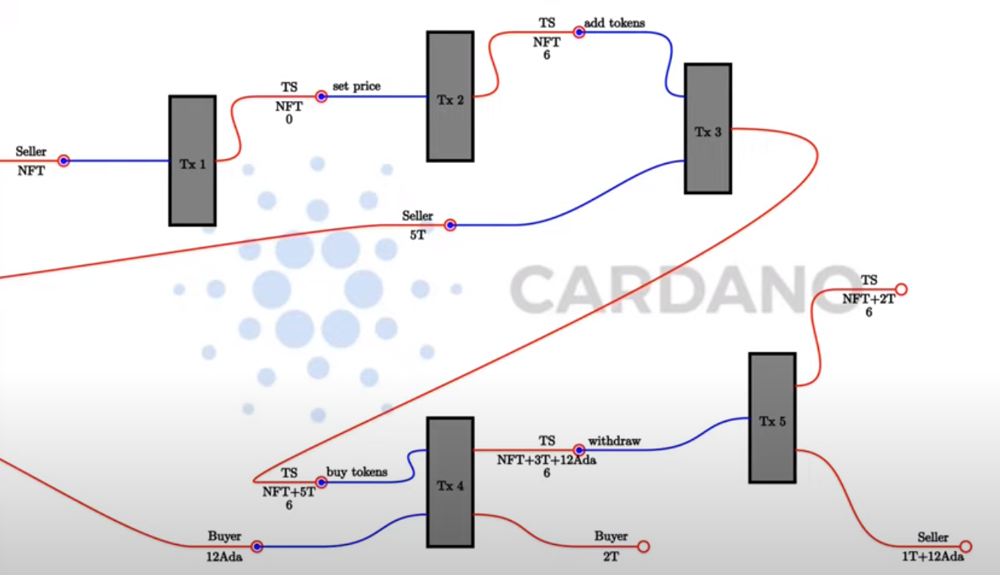

Clase 08
- [Video](https://www.youtube.com/watch?v=zW3D2iM5uVg)
- [Notas]()

# Pruebas (Testing)
- Esta clase comienza con otro ejemplo de máquinas de estados y luego continuará explicando cómo probar un contrato.
- El objeto del contrato es vender _tokens_: un usuario quiere vender sus _tokens_ a un precio determinado.

## Flujo


- En el diagrama se describen todas las operaciones posibles que, por supuesto, deben poder realalizarse en cualquier orden.

##  Código
- [TokenSale.hs](../code/src/TokenSale.hs)

- El contracto se ha diseñado según una máquina de estados.
- Las operaciones definen las transiciones
    - _SetPrice_: Fija el precio del _token_
        - El precio debe ser mayor que cero y la transacción debe estar firmada por el vendedor (_seller_)
    - _AddTokens_: Añade _tokens_ al contrato. 
        - Cualquiera puede añadir tokens
    - _BuyTokens_: Compra _tokens_ a un precio dado.
    - _Withdraw_: El vendedor puede retirar ADA o _tokens_ del contrato.
        - Por supuesto solo el vendedor puede realizar esta operación.

- Esta máquina de estados no tiene estados finales, atención al paramétro _(const False)_, por tanto, se ejecutará para siempre.
```haskell
{-# INLINABLE tsStateMachine #-}
tsStateMachine :: TokenSale -> StateMachine Integer TSRedeemer
tsStateMachine ts = mkStateMachine (tsTT ts) (transition ts) (const False)
```

- El código _off chain_ implementa las operaciones que hemos descrito como _endpoints_ que permiten _avanzar_ la máquina a un estado.
    - _startTS_: Creación de la máquina y del cliente.
    - _setPrice_:
    - _addTokens_
    - _buyTokens_
    - _withdraw_:

- La _firma_ de la función _endpoint_ a cambiado. Ahora es un poco más complicada.
    - Ahora devuelve una _promesa_ , _Promise_.
        - El tipo _Promise_, significa que el contrato arranca esperando a que ocurra algo. Debe usarse con _select_.
        - El tipo _awaitPromise_: Devuelve un _Contract_
        - _select_: 
            > Devuelve el contrato que progresa primero descartando el otro ¿? (¿no será los otros?)

```haskell
    type TSStartSchema =
        Endpoint "start"      (CurrencySymbol, TokenName, Bool)
type TSUseSchema =
        Endpoint "set price"  Integer
    .\/ Endpoint "add tokens" Integer
    .\/ Endpoint "buy tokens" Integer
    .\/ Endpoint "withdraw"   (Integer, Integer)

startEndpoint :: Contract (Last TokenSale) TSStartSchema Text ()
startEndpoint = forever
              $ handleError logError
              $ awaitPromise
              $ endpoint @"start" $ \(cs, tn, useTT) -> startTS (AssetClass (cs, tn)) useTT

useEndpoints :: TokenSale -> Contract () TSUseSchema Text ()
useEndpoints ts = forever
                $ handleError logError
                $ awaitPromise
                $ setPrice' `select` addTokens' `select` buyTokens' `select` withdraw'
  where
    setPrice'  = endpoint @"set price"  $ setPrice ts
    addTokens' = endpoint @"add tokens" $ addTokens ts
    buyTokens' = endpoint @"buy tokens" $ buyTokens ts
    withdraw'  = endpoint @"withdraw"   $ uncurry (withdraw ts)
```

- _startEndpoint_: Es un bucle que permite arrancar la venta de diferentes _tokens_. Cada _token_ tendrá asociada una máquina de estado diferente (es lo que yo he entendido)
- El resto son las operaciones del flujo.
- _uncurry_: _deparcializa_, transforma la llamada de una función con dos parámetros, a una llamada con un único parámetro que es una _tupla_.

## Prueba
- [Trace.hs](../test/Spec/Trace.hs)
- Resultados de la ejecución de la prueba
```
[nix-shell:~/workspace/cardano/plutus-pioneer-program/code/week08]$ cabal repl plutus-pioneer-program-week08-tests
Build profile: -w ghc-8.10.4.20210212 -O1
In order, the following will be built (use -v for more details):
 - plutus-pioneer-program-week08-0.1.0.0 (test:plutus-pioneer-program-week08-tests) (ephemeral targets)
Preprocessing test suite 'plutus-pioneer-program-week08-tests' for plutus-pioneer-program-week08-0.1.0.0..
GHCi, version 8.10.4.20210212: https://www.haskell.org/ghc/  :? for help
[1 of 5] Compiling Spec.Model       ( test/Spec/Model.hs, /home/fpalomo/workspace/cardano/plutus-pioneer-program/code/week08/dist-newstyle/build/x86_64-linux/ghc-8.10.4.20210212/plutus-pioneer-program-week08-0.1.0.0/t/plutus-pioneer-program-week08-tests/build/plutus-pioneer-program-week08-tests/plutus-pioneer-program-week08-tests-tmp/Spec/Model.o )
[2 of 5] Compiling Spec.ModelWithClose ( test/Spec/ModelWithClose.hs, /home/fpalomo/workspace/cardano/plutus-pioneer-program/code/week08/dist-newstyle/build/x86_64-linux/ghc-8.10.4.20210212/plutus-pioneer-program-week08-0.1.0.0/t/plutus-pioneer-program-week08-tests/build/plutus-pioneer-program-week08-tests/plutus-pioneer-program-week08-tests-tmp/Spec/ModelWithClose.o )
[3 of 5] Compiling Spec.Trace       ( test/Spec/Trace.hs, /home/fpalomo/workspace/cardano/plutus-pioneer-program/code/week08/dist-newstyle/build/x86_64-linux/ghc-8.10.4.20210212/plutus-pioneer-program-week08-0.1.0.0/t/plutus-pioneer-program-week08-tests/build/plutus-pioneer-program-week08-tests/plutus-pioneer-program-week08-tests-tmp/Spec/Trace.o )
[4 of 5] Compiling Spec.TraceWithClose ( test/Spec/TraceWithClose.hs, /home/fpalomo/workspace/cardano/plutus-pioneer-program/code/week08/dist-newstyle/build/x86_64-linux/ghc-8.10.4.20210212/plutus-pioneer-program-week08-0.1.0.0/t/plutus-pioneer-program-week08-tests/build/plutus-pioneer-program-week08-tests/plutus-pioneer-program-week08-tests-tmp/Spec/TraceWithClose.o )
[5 of 5] Compiling Main             ( test/Spec.hs, /home/fpalomo/workspace/cardano/plutus-pioneer-program/code/week08/dist-newstyle/build/x86_64-linux/ghc-8.10.4.20210212/plutus-pioneer-program-week08-0.1.0.0/t/plutus-pioneer-program-week08-tests/build/plutus-pioneer-program-week08-tests/plutus-pioneer-program-week08-tests-tmp/Main.o )
Ok, five modules loaded.
Prelude Main> :l test/Spec/Trace.hs 
Ok, one module loaded.
Prelude Spec.Trace> runMyTrace 
Slot 00000: TxnValidate 437d7d2cdb4ea28f5b88226b1cc04955142e83334c5bf69396cc90fb47610cba
Slot 00000: SlotAdd Slot 1
Slot 00001: 00000000-0000-4000-8000-000000000000 {Contract instance for wallet 1}:
  Contract instance started
Slot 00001: 00000000-0000-4000-8000-000000000000 {Contract instance for wallet 1}:
  Receive endpoint call on 'start' for Object (fromList [("contents",Array [Object (fromList [("getEndpointDescription",String "start")]),Object (fromList [("unEndpointValue",Array [Object (fromList [("unCurrencySymbol",String "aa")]),Object (fromList [("unTokenName",String "A")]),Bool True])])]),("tag",String "ExposeEndpointResp")])
Slot 00001: W1: TxSubmit: 8505bb8a14dcf60e685e0431d4601e518783ab5cfb1127ade2a73b1e87e50530
Slot 00001: TxnValidate 8505bb8a14dcf60e685e0431d4601e518783ab5cfb1127ade2a73b1e87e50530
Slot 00001: SlotAdd Slot 2
Slot 00002: *** CONTRACT LOG: "started token sale TokenSale {tsSeller = 35dedd2982a03cf39e7dce03c839994ffdec2ec6b04f1cf2d40e61a3, tsToken = (aa,\"A\"), tsTT = Just (ThreadToken {ttOutRef = TxOutRef {txOutRefId = 437d7d2cdb4ea28f5b88226b1cc04955142e83334c5bf69396cc90fb47610cba, txOutRefIdx = 1}, ttCurrencySymbol = 7add1b147dfd1cbd1cf0bffe05181a940ebaf94cfd7a3405c41e573a})}"
Slot 00002: SlotAdd Slot 3
Slot 00003: SlotAdd Slot 4
Slot 00004: SlotAdd Slot 5
Slot 00005: SlotAdd Slot 6
Slot 00006: 00000000-0000-4000-8000-000000000000 {Contract instance for wallet 1}:
  Sending contract state to Thread 0
Slot 00006: SlotAdd Slot 7
Slot 00007: *** USER LOG: started token sale TokenSale {tsSeller = 35dedd2982a03cf39e7dce03c839994ffdec2ec6b04f1cf2d40e61a3, tsToken = (aa,"A"), tsTT = Just (ThreadToken {ttOutRef = TxOutRef {txOutRefId = 437d7d2cdb4ea28f5b88226b1cc04955142e83334c5bf69396cc90fb47610cba, txOutRefIdx = 1}, ttCurrencySymbol = 7add1b147dfd1cbd1cf0bffe05181a940ebaf94cfd7a3405c41e573a})}
Slot 00007: 00000000-0000-4000-8000-000000000001 {Contract instance for wallet 1}:
  Contract instance started
Slot 00007: 00000000-0000-4000-8000-000000000002 {Contract instance for wallet 2}:
  Contract instance started
Slot 00007: 00000000-0000-4000-8000-000000000003 {Contract instance for wallet 3}:
  Contract instance started
Slot 00007: 00000000-0000-4000-8000-000000000001 {Contract instance for wallet 1}:
  Receive endpoint call on 'set price' for Object (fromList [("contents",Array [Object (fromList [("getEndpointDescription",String "set price")]),Object (fromList [("unEndpointValue",Number 1000000.0)])]),("tag",String "ExposeEndpointResp")])
Slot 00007: W1: TxSubmit: 8aef833659b6bcbd5a4bd4c46da4bb3774abc7aea04c2a2103f97b9d482c970c
Slot 00007: TxnValidate 8aef833659b6bcbd5a4bd4c46da4bb3774abc7aea04c2a2103f97b9d482c970c
Slot 00007: SlotAdd Slot 8
Slot 00008: SlotAdd Slot 9
Slot 00009: SlotAdd Slot 10
Slot 00010: SlotAdd Slot 11
Slot 00011: SlotAdd Slot 12
Slot 00012: 00000000-0000-4000-8000-000000000001 {Contract instance for wallet 1}:
  Receive endpoint call on 'add tokens' for Object (fromList [("contents",Array [Object (fromList [("getEndpointDescription",String "add tokens")]),Object (fromList [("unEndpointValue",Number 100.0)])]),("tag",String "ExposeEndpointResp")])
Slot 00012: W1: TxSubmit: f93d59f100209f72ecbc6f6a138e5a55905b555fc823b23ea05afc1c6fe51dda
Slot 00012: TxnValidate f93d59f100209f72ecbc6f6a138e5a55905b555fc823b23ea05afc1c6fe51dda
Slot 00012: SlotAdd Slot 13
Slot 00013: SlotAdd Slot 14
Slot 00014: SlotAdd Slot 15
Slot 00015: SlotAdd Slot 16
Slot 00016: SlotAdd Slot 17
Slot 00017: 00000000-0000-4000-8000-000000000002 {Contract instance for wallet 2}:
  Receive endpoint call on 'buy tokens' for Object (fromList [("contents",Array [Object (fromList [("getEndpointDescription",String "buy tokens")]),Object (fromList [("unEndpointValue",Number 20.0)])]),("tag",String "ExposeEndpointResp")])
Slot 00017: W2: TxSubmit: 76faf4203d4a7237100e9f044ef39b28fdbde93e078b5157e304ffaa8e827241
Slot 00017: TxnValidate 76faf4203d4a7237100e9f044ef39b28fdbde93e078b5157e304ffaa8e827241
Slot 00017: SlotAdd Slot 18
Slot 00018: SlotAdd Slot 19
Slot 00019: SlotAdd Slot 20
Slot 00020: SlotAdd Slot 21
Slot 00021: SlotAdd Slot 22
Slot 00022: 00000000-0000-4000-8000-000000000003 {Contract instance for wallet 3}:
  Receive endpoint call on 'buy tokens' for Object (fromList [("contents",Array [Object (fromList [("getEndpointDescription",String "buy tokens")]),Object (fromList [("unEndpointValue",Number 5.0)])]),("tag",String "ExposeEndpointResp")])
Slot 00022: W3: TxSubmit: 9e5a5e5d8ede6dff4fb179f1b02a5fcc024585f887969138b19534d077721cf2
Slot 00022: TxnValidate 9e5a5e5d8ede6dff4fb179f1b02a5fcc024585f887969138b19534d077721cf2
Slot 00022: SlotAdd Slot 23
Slot 00023: SlotAdd Slot 24
Slot 00024: SlotAdd Slot 25
Slot 00025: SlotAdd Slot 26
Slot 00026: SlotAdd Slot 27
Slot 00027: 00000000-0000-4000-8000-000000000001 {Contract instance for wallet 1}:
  Receive endpoint call on 'withdraw' for Object (fromList [("contents",Array [Object (fromList [("getEndpointDescription",String "withdraw")]),Object (fromList [("unEndpointValue",Array [Number 40.0,Number 1.0e7])])]),("tag",String "ExposeEndpointResp")])
Slot 00027: W1: TxSubmit: a2c8ccaf9c1d33251495fb21855e77176d0b11e064c9d2ac63359cdf72832431
Slot 00027: TxnValidate a2c8ccaf9c1d33251495fb21855e77176d0b11e064c9d2ac63359cdf72832431
Slot 00027: SlotAdd Slot 28
Slot 00028: SlotAdd Slot 29
Slot 00029: SlotAdd Slot 30
Slot 00030: SlotAdd Slot 31
Slot 00031: SlotAdd Slot 32
Slot 00032: SlotAdd Slot 33
Final balances
Wallet 1: 
    {, ""}: 1009966751
    {aa, "A"}: 940
Wallet 2: 
    {aa, "A"}: 1020
    {, ""}: 979990153
Wallet 3: 
    {aa, "A"}: 1005
    {, ""}: 994990153
Script 40f67121649a9aa06e59c7714cb2f38790fe539b1f506e070845c0d1: 
    {7add1b147dfd1cbd1cf0bffe05181a940ebaf94cfd7a3405c41e573a, 0x40f67121649a9aa06e59c7714cb2f38790fe539b1f506e070845c0d1}: 1
    {aa, "A"}: 35
    {, ""}: 15000000
Prelude Spec.Trace> 
```

# Tasty: _framework_ para pruebas en Haskell
- [Tasty](https://hackage.haskell.org/package/tasty)
- [Plutus.Contract.Test]() 
    - Es un integración de Tasty en Plutus.
    - Se basa en comprobar _predicados_ 

```haskell
tests :: TestTree
tests = checkPredicateOptions
    (defaultCheckOptions & emulatorConfig .~ emCfg)
    "token sale trace"
    (     walletFundsChange (Wallet 1) (Ada.lovelaceValueOf   10_000_000  <> assetClassValue token (-60))
     .&&. walletFundsChange (Wallet 2) (Ada.lovelaceValueOf (-20_000_000) <> assetClassValue token   20)
     .&&. walletFundsChange (Wallet 3) (Ada.lovelaceValueOf (- 5_000_000) <> assetClassValue token    5)
    )
    myTrace
 ```
## Ejecución de los tests
- Ok
```
Prelude Test.Tasty Spec.Trace> defaultMain tests
token sale trace: OK (0.13s)

All 1 tests passed (0.13s)
*** Exception: ExitSuccess
Prelude Test.Tasty Spec.Trace> 
```

- Fallo: cambiamos el valor en _token_ de 60 a 50.
>     (     walletFundsChange (Wallet 1) (Ada.lovelaceValueOf   10_000_000  <> assetClassValue token (-50))

 ```
 Prelude Test.Tasty Spec.Trace> defaultMain tests
token sale trace: FAIL (0.14s)
  Expected funds of W1 to change by
    Value (Map [(,Map [("",10000000)]),(aa,Map [("A",-50)])])
    (excluding 33249 lovelace in fees)
  but they changed by
    Value (Map [(,Map [("",10000000)]),(aa,Map [("A",-60)])])
  Test failed.
  Emulator log:
  [INFO] Slot 0: TxnValidate 437d7d2cdb4ea28f5b88226b1cc04955142e83334c5bf69396cc90fb47610cba
  [INFO] Slot 1: 00000000-0000-4000-8000-000000000000 {Contract instance for wallet 1}:
                   Contract instance started
  [INFO] Slot 1: 00000000-0000-4000-8000-000000000000 {Contract instance for wallet 1}:
                   Receive endpoint call on 'start' for Object (fromList [("contents",Array [Object (fromList [("getEndpointDescription",String "start")]),Object (fromList [("unEndpointValue",Array [Object (fromList [("unCurrencySymbol",String "aa")]),Object (fromList [("unTokenName",String "A")]),Bool True])])]),("tag",String "ExposeEndpointResp")])
  [INFO] Slot 1: W1: Balancing an unbalanced transaction:
                       Tx:
                         Tx 0993ee5303225eaf92f6142a2373a861525f8b3545091f0523661f1a373ad0cc:
                           {inputs:
                           collateral inputs:
                           outputs:
                             - Value (Map [(,Map [("",1)])]) addressed to
                               addressed to PubKeyCredential: 35dedd2982a03cf39e7dce03c839994ffdec2ec6b04f1cf2d40e61a3 (no staking credential)
                           mint: Value (Map [])
                           fee: Value (Map [])
                           mps:
                           signatures:
                           validity range: Interval {ivFrom = LowerBound NegInf True, ivTo = UpperBound PosInf True}
                           data:}
                       Requires signatures:
                       Utxo index:
  [INFO] Slot 1: W1: Finished balancing. ef82b8bb3117f24b2294599dec645124aaec99d16c312820512e078cc920fa3b
  [INFO] Slot 1: W1: Balancing an unbalanced transaction:
                       Tx:
                         Tx 986f721a395908906b26f2650c92ca66748b793734deed96a46efa8aa57e561d:
                           {inputs:
                              - 437d7d2cdb4ea28f5b88226b1cc04955142e83334c5bf69396cc90fb47610cba!1
  
                           collateral inputs:
                           outputs:
                             - Value (Map [(7add1b147dfd1cbd1cf0bffe05181a940ebaf94cfd7a3405c41e573a,Map [(0x40f67121649a9aa06e59c7714cb2f38790fe539b1f506e070845c0d1,1)])]) addressed to
                               addressed to ScriptCredential: 40f67121649a9aa06e59c7714cb2f38790fe539b1f506e070845c0d1 (no staking credential)
                           mint: Value (Map [(7add1b147dfd1cbd1cf0bffe05181a940ebaf94cfd7a3405c41e573a,Map [(0x40f67121649a9aa06e59c7714cb2f38790fe539b1f506e070845c0d1,1)])])
                           fee: Value (Map [])
                           mps:
                             MintingPolicy { <script> }
                           signatures:
                           validity range: Interval {ivFrom = LowerBound NegInf True, ivTo = UpperBound PosInf True}
                           data:
                             0}
                       Requires signatures:
                         35dedd2982a03cf39e7dce03c839994ffdec2ec6b04f1cf2d40e61a3
                       Utxo index:
                         ( 437d7d2cdb4ea28f5b88226b1cc04955142e83334c5bf69396cc90fb47610cba!1
                         , - Value (Map [(,Map [("",1000000000)]),(aa,Map [("A",1000)])]) addressed to
                             addressed to PubKeyCredential: 35dedd2982a03cf39e7dce03c839994ffdec2ec6b04f1cf2d40e61a3 (no staking credential) )
  [INFO] Slot 1: W1: Finished balancing. 8505bb8a14dcf60e685e0431d4601e518783ab5cfb1127ade2a73b1e87e50530
  [INFO] Slot 1: W1: Submitting tx: 8505bb8a14dcf60e685e0431d4601e518783ab5cfb1127ade2a73b1e87e50530
  [INFO] Slot 1: W1: TxSubmit: 8505bb8a14dcf60e685e0431d4601e518783ab5cfb1127ade2a73b1e87e50530
  [INFO] Slot 1: TxnValidate 8505bb8a14dcf60e685e0431d4601e518783ab5cfb1127ade2a73b1e87e50530
  [INFO] Slot 2: 00000000-0000-4000-8000-000000000000 {Contract instance for wallet 1}:
                   Contract log: String "started token sale TokenSale {tsSeller = 35dedd2982a03cf39e7dce03c839994ffdec2ec6b04f1cf2d40e61a3, tsToken = (aa,\"A\"), tsTT = Just (ThreadToken {ttOutRef = TxOutRef {txOutRefId = 437d7d2cdb4ea28f5b88226b1cc04955142e83334c5bf69396cc90fb47610cba, txOutRefIdx = 1}, ttCurrencySymbol = 7add1b147dfd1cbd1cf0bffe05181a940ebaf94cfd7a3405c41e573a})}"
  [INFO] Slot 6: 00000000-0000-4000-8000-000000000000 {Contract instance for wallet 1}:
                   Sending contract state to Thread 0
  [INFO] Slot 7: started token sale TokenSale {tsSeller = 35dedd2982a03cf39e7dce03c839994ffdec2ec6b04f1cf2d40e61a3, tsToken = (aa,"A"), tsTT = Just (ThreadToken {ttOutRef = TxOutRef {txOutRefId = 437d7d2cdb4ea28f5b88226b1cc04955142e83334c5bf69396cc90fb47610cba, txOutRefIdx = 1}, ttCurrencySymbol = 7add1b147dfd1cbd1cf0bffe05181a940ebaf94cfd7a3405c41e573a})}
  [INFO] Slot 7: 00000000-0000-4000-8000-000000000001 {Contract instance for wallet 1}:
                   Contract instance started
  [INFO] Slot 7: 00000000-0000-4000-8000-000000000002 {Contract instance for wallet 2}:
                   Contract instance started
  [INFO] Slot 7: 00000000-0000-4000-8000-000000000003 {Contract instance for wallet 3}:
                   Contract instance started
  [INFO] Slot 7: 00000000-0000-4000-8000-000000000001 {Contract instance for wallet 1}:
                   Receive endpoint call on 'set price' for Object (fromList [("contents",Array [Object (fromList [("getEndpointDescription",String "set price")]),Object (fromList [("unEndpointValue",Number 1000000.0)])]),("tag",String "ExposeEndpointResp")])
  [INFO] Slot 7: W1: Balancing an unbalanced transaction:
                       Tx:
                         Tx 7cde65084c709116f596f6e6510ff7df65f1f627c25e408b4616768abbe31403:
                           {inputs:
                              - 8505bb8a14dcf60e685e0431d4601e518783ab5cfb1127ade2a73b1e87e50530!1
                                <1000000>
                           collateral inputs:
                           outputs:
                             - Value (Map [(7add1b147dfd1cbd1cf0bffe05181a940ebaf94cfd7a3405c41e573a,Map [(0x40f67121649a9aa06e59c7714cb2f38790fe539b1f506e070845c0d1,1)])]) addressed to
                               addressed to ScriptCredential: 40f67121649a9aa06e59c7714cb2f38790fe539b1f506e070845c0d1 (no staking credential)
                           mint: Value (Map [])
                           fee: Value (Map [])
                           mps:
                           signatures:
                           validity range: Interval {ivFrom = LowerBound NegInf True, ivTo = UpperBound PosInf True}
                           data:
                             1000000}
                       Requires signatures:
                         35dedd2982a03cf39e7dce03c839994ffdec2ec6b04f1cf2d40e61a3
                       Utxo index:
                         ( 8505bb8a14dcf60e685e0431d4601e518783ab5cfb1127ade2a73b1e87e50530!1
                         , - Value (Map [(7add1b147dfd1cbd1cf0bffe05181a940ebaf94cfd7a3405c41e573a,Map [(0x40f67121649a9aa06e59c7714cb2f38790fe539b1f506e070845c0d1,1)])]) addressed to
                             addressed to ScriptCredential: 40f67121649a9aa06e59c7714cb2f38790fe539b1f506e070845c0d1 (no staking credential) )
  [INFO] Slot 7: W1: Finished balancing. 8aef833659b6bcbd5a4bd4c46da4bb3774abc7aea04c2a2103f97b9d482c970c
  [INFO] Slot 7: W1: Submitting tx: 8aef833659b6bcbd5a4bd4c46da4bb3774abc7aea04c2a2103f97b9d482c970c
  [INFO] Slot 7: W1: TxSubmit: 8aef833659b6bcbd5a4bd4c46da4bb3774abc7aea04c2a2103f97b9d482c970c
  [INFO] Slot 7: TxnValidate 8aef833659b6bcbd5a4bd4c46da4bb3774abc7aea04c2a2103f97b9d482c970c
  [INFO] Slot 12: 00000000-0000-4000-8000-000000000001 {Contract instance for wallet 1}:
                    Receive endpoint call on 'add tokens' for Object (fromList [("contents",Array [Object (fromList [("getEndpointDescription",String "add tokens")]),Object (fromList [("unEndpointValue",Number 100.0)])]),("tag",String "ExposeEndpointResp")])
  [INFO] Slot 12: W1: Balancing an unbalanced transaction:
                        Tx:
                          Tx 97eb8c9db23ac7f0d7a746f36e058171caa961c84358b416411c93987e9038d7:
                            {inputs:
                               - 8aef833659b6bcbd5a4bd4c46da4bb3774abc7aea04c2a2103f97b9d482c970c!1
                                 <100>
                            collateral inputs:
                            outputs:
                              - Value (Map [(7add1b147dfd1cbd1cf0bffe05181a940ebaf94cfd7a3405c41e573a,Map [(0x40f67121649a9aa06e59c7714cb2f38790fe539b1f506e070845c0d1,1)]),(aa,Map [("A",100)])]) addressed to
                                addressed to ScriptCredential: 40f67121649a9aa06e59c7714cb2f38790fe539b1f506e070845c0d1 (no staking credential)
                            mint: Value (Map [])
                            fee: Value (Map [])
                            mps:
                            signatures:
                            validity range: Interval {ivFrom = LowerBound NegInf True, ivTo = UpperBound PosInf True}
                            data:
                              1000000}
                        Requires signatures:
                        Utxo index:
                          ( 8aef833659b6bcbd5a4bd4c46da4bb3774abc7aea04c2a2103f97b9d482c970c!1
                          , - Value (Map [(7add1b147dfd1cbd1cf0bffe05181a940ebaf94cfd7a3405c41e573a,Map [(0x40f67121649a9aa06e59c7714cb2f38790fe539b1f506e070845c0d1,1)])]) addressed to
                              addressed to ScriptCredential: 40f67121649a9aa06e59c7714cb2f38790fe539b1f506e070845c0d1 (no staking credential) )
  [INFO] Slot 12: W1: Finished balancing. f93d59f100209f72ecbc6f6a138e5a55905b555fc823b23ea05afc1c6fe51dda
  [INFO] Slot 12: W1: Submitting tx: f93d59f100209f72ecbc6f6a138e5a55905b555fc823b23ea05afc1c6fe51dda
  [INFO] Slot 12: W1: TxSubmit: f93d59f100209f72ecbc6f6a138e5a55905b555fc823b23ea05afc1c6fe51dda
  [INFO] Slot 12: TxnValidate f93d59f100209f72ecbc6f6a138e5a55905b555fc823b23ea05afc1c6fe51dda
  [INFO] Slot 17: 00000000-0000-4000-8000-000000000002 {Contract instance for wallet 2}:
                    Receive endpoint call on 'buy tokens' for Object (fromList [("contents",Array [Object (fromList [("getEndpointDescription",String "buy tokens")]),Object (fromList [("unEndpointValue",Number 20.0)])]),("tag",String "ExposeEndpointResp")])
  [INFO] Slot 17: W2: Balancing an unbalanced transaction:
                        Tx:
                          Tx e6550619e58712c909b251db7d3ee4388c9d0146534a4b4865821508dbff158c:
                            {inputs:
                               - f93d59f100209f72ecbc6f6a138e5a55905b555fc823b23ea05afc1c6fe51dda!1
                                 <20>
                            collateral inputs:
                            outputs:
                              - Value (Map [(,Map [("",20000000)]),(7add1b147dfd1cbd1cf0bffe05181a940ebaf94cfd7a3405c41e573a,Map [(0x40f67121649a9aa06e59c7714cb2f38790fe539b1f506e070845c0d1,1)]),(aa,Map [("A",80)])]) addressed to
                                addressed to ScriptCredential: 40f67121649a9aa06e59c7714cb2f38790fe539b1f506e070845c0d1 (no staking credential)
                            mint: Value (Map [])
                            fee: Value (Map [])
                            mps:
                            signatures:
                            validity range: Interval {ivFrom = LowerBound NegInf True, ivTo = UpperBound PosInf True}
                            data:
                              1000000}
                        Requires signatures:
                        Utxo index:
                          ( f93d59f100209f72ecbc6f6a138e5a55905b555fc823b23ea05afc1c6fe51dda!1
                          , - Value (Map [(7add1b147dfd1cbd1cf0bffe05181a940ebaf94cfd7a3405c41e573a,Map [(0x40f67121649a9aa06e59c7714cb2f38790fe539b1f506e070845c0d1,1)]),(aa,Map [("A",100)])]) addressed to
                              addressed to ScriptCredential: 40f67121649a9aa06e59c7714cb2f38790fe539b1f506e070845c0d1 (no staking credential) )
  [INFO] Slot 17: W2: Finished balancing. 76faf4203d4a7237100e9f044ef39b28fdbde93e078b5157e304ffaa8e827241
  [INFO] Slot 17: W2: Submitting tx: 76faf4203d4a7237100e9f044ef39b28fdbde93e078b5157e304ffaa8e827241
  [INFO] Slot 17: W2: TxSubmit: 76faf4203d4a7237100e9f044ef39b28fdbde93e078b5157e304ffaa8e827241
  [INFO] Slot 17: TxnValidate 76faf4203d4a7237100e9f044ef39b28fdbde93e078b5157e304ffaa8e827241
  [INFO] Slot 22: 00000000-0000-4000-8000-000000000003 {Contract instance for wallet 3}:
                    Receive endpoint call on 'buy tokens' for Object (fromList [("contents",Array [Object (fromList [("getEndpointDescription",String "buy tokens")]),Object (fromList [("unEndpointValue",Number 5.0)])]),("tag",String "ExposeEndpointResp")])
  [INFO] Slot 22: W3: Balancing an unbalanced transaction:
                        Tx:
                          Tx 5da46bf34823050b60d9eb60df9af2fba0f7d24907de1a55b5befe0389db5b90:
                            {inputs:
                               - 76faf4203d4a7237100e9f044ef39b28fdbde93e078b5157e304ffaa8e827241!2
                                 <5>
                            collateral inputs:
                            outputs:
                              - Value (Map [(,Map [("",25000000)]),(7add1b147dfd1cbd1cf0bffe05181a940ebaf94cfd7a3405c41e573a,Map [(0x40f67121649a9aa06e59c7714cb2f38790fe539b1f506e070845c0d1,1)]),(aa,Map [("A",75)])]) addressed to
                                addressed to ScriptCredential: 40f67121649a9aa06e59c7714cb2f38790fe539b1f506e070845c0d1 (no staking credential)
                            mint: Value (Map [])
                            fee: Value (Map [])
                            mps:
                            signatures:
                            validity range: Interval {ivFrom = LowerBound NegInf True, ivTo = UpperBound PosInf True}
                            data:
                              1000000}
                        Requires signatures:
                        Utxo index:
                          ( 76faf4203d4a7237100e9f044ef39b28fdbde93e078b5157e304ffaa8e827241!2
                          , - Value (Map [(,Map [("",20000000)]),(7add1b147dfd1cbd1cf0bffe05181a940ebaf94cfd7a3405c41e573a,Map [(0x40f67121649a9aa06e59c7714cb2f38790fe539b1f506e070845c0d1,1)]),(aa,Map [("A",80)])]) addressed to
                              addressed to ScriptCredential: 40f67121649a9aa06e59c7714cb2f38790fe539b1f506e070845c0d1 (no staking credential) )
  [INFO] Slot 22: W3: Finished balancing. 9e5a5e5d8ede6dff4fb179f1b02a5fcc024585f887969138b19534d077721cf2
  [INFO] Slot 22: W3: Submitting tx: 9e5a5e5d8ede6dff4fb179f1b02a5fcc024585f887969138b19534d077721cf2
  [INFO] Slot 22: W3: TxSubmit: 9e5a5e5d8ede6dff4fb179f1b02a5fcc024585f887969138b19534d077721cf2
  [INFO] Slot 22: TxnValidate 9e5a5e5d8ede6dff4fb179f1b02a5fcc024585f887969138b19534d077721cf2
  [INFO] Slot 27: 00000000-0000-4000-8000-000000000001 {Contract instance for wallet 1}:
                    Receive endpoint call on 'withdraw' for Object (fromList [("contents",Array [Object (fromList [("getEndpointDescription",String "withdraw")]),Object (fromList [("unEndpointValue",Array [Number 40.0,Number 1.0e7])])]),("tag",String "ExposeEndpointResp")])
  [INFO] Slot 27: W1: Balancing an unbalanced transaction:
                        Tx:
                          Tx 65a493b3918a9288ad91c90f27398d0b18604e509435614139380af53dbb0176:
                            {inputs:
                               - 9e5a5e5d8ede6dff4fb179f1b02a5fcc024585f887969138b19534d077721cf2!2
                                 <40, 10000000>
                            collateral inputs:
                            outputs:
                              - Value (Map [(,Map [("",15000000)]),(7add1b147dfd1cbd1cf0bffe05181a940ebaf94cfd7a3405c41e573a,Map [(0x40f67121649a9aa06e59c7714cb2f38790fe539b1f506e070845c0d1,1)]),(aa,Map [("A",35)])]) addressed to
                                addressed to ScriptCredential: 40f67121649a9aa06e59c7714cb2f38790fe539b1f506e070845c0d1 (no staking credential)
                            mint: Value (Map [])
                            fee: Value (Map [])
                            mps:
                            signatures:
                            validity range: Interval {ivFrom = LowerBound NegInf True, ivTo = UpperBound PosInf True}
                            data:
                              1000000}
                        Requires signatures:
                          35dedd2982a03cf39e7dce03c839994ffdec2ec6b04f1cf2d40e61a3
                        Utxo index:
                          ( 9e5a5e5d8ede6dff4fb179f1b02a5fcc024585f887969138b19534d077721cf2!2
                          , - Value (Map [(,Map [("",25000000)]),(7add1b147dfd1cbd1cf0bffe05181a940ebaf94cfd7a3405c41e573a,Map [(0x40f67121649a9aa06e59c7714cb2f38790fe539b1f506e070845c0d1,1)]),(aa,Map [("A",75)])]) addressed to
                              addressed to ScriptCredential: 40f67121649a9aa06e59c7714cb2f38790fe539b1f506e070845c0d1 (no staking credential) )
  [INFO] Slot 27: W1: Finished balancing. a2c8ccaf9c1d33251495fb21855e77176d0b11e064c9d2ac63359cdf72832431
  [INFO] Slot 27: W1: Submitting tx: a2c8ccaf9c1d33251495fb21855e77176d0b11e064c9d2ac63359cdf72832431
  [INFO] Slot 27: W1: TxSubmit: a2c8ccaf9c1d33251495fb21855e77176d0b11e064c9d2ac63359cdf72832431
  [INFO] Slot 27: TxnValidate a2c8ccaf9c1d33251495fb21855e77176d0b11e064c9d2ac63359cdf72832431
    src/Plutus/Contract/Test.hs:241:
    token sale trace

1 out of 1 tests failed (0.14s)
*** Exception: ExitFailure 1
Prelude Test.Tasty Spec.Trace> 

```

- En general, construiremos un emulador y lo utilizaremos comprobando ciertos condiciones, predicados, del resultado de la ejecución.
- Plutus.Contract.Test tiene un serie de funciones de comprobación de predicados sobre los monederos y otros valores. Es similar a las API que ofrecen otros entornos de pruebas como _pytest_ o _phpunit_ , pero específico para Plutus.

# _Optics_ & _Lens_
[Lens ](https://hackage.haskell.org/package/lens)
[Tutorial](https://www.schoolofhaskell.com/school/to-infinity-and-beyond/pick-of-the-week/a-little-lens-starter-tutorial)
- _Optics_ es un concepto de Haskell, desarrollado en un paquete _Lens_ (hay más pero han elegido este)
- Ofrece un conjunto de funciones para manejar estructuras de datos.
- _Lens_ (lentes) son funciones que permiten operar sobre tipos de datos complejos, _enfocando_ un parte específica de la estructura, inspeccionándola o manipulándola.
## Ejemplo
[Lens.hs](../code/src/Lens.hs)
